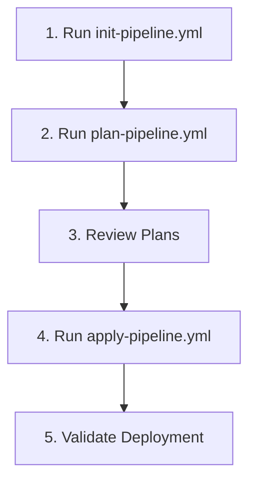
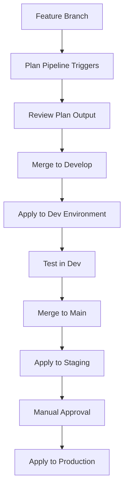

# Azure DevOps Pipeline Implementation Guide
## TRL Hub and Spoke Infrastructure - Complete Setup Guide

This guide provides step-by-step instructions for implementing Azure DevOps pipelines for the TRL Hub and Spoke infrastructure project across multiple Azure subscriptions.

## Table of Contents

1. [Azure Subscriptions Setup](#azure-subscriptions-setup)
2. [Azure DevOps Project Setup](#azure-devops-project-setup)
3. [Service Connections Configuration](#service-connections-configuration)
4. [Agent Pools Setup](#agent-pools-setup)
5. [Environment Configuration](#environment-configuration)
6. [Variable Groups and Key Vault Integration](#variable-groups-and-key-vault-integration)
7. [Pipeline Implementation](#pipeline-implementation)
8. [Build Agents Configuration](#build-agents-configuration)
9. [Parallel Jobs Setup](#parallel-jobs-setup)
10. [Testing and Validation](#testing-and-validation)

## Azure Subscriptions Setup

### Subscription Overview

This project uses three dedicated Azure subscriptions following TRL naming convention:

| Environment     | Subscription Name  | Subscription ID Pattern                | Purpose                                |
|-----------------|--------------------|----------------------------------------|----------------------------------------|
| **Development** | `Sub-TRL-dev-weu`  | `xxxxxxxx-xxxx-xxxx-xxxx-xxxxxxxxxxxx` | Development workloads and testing      |
| **Staging**     | `Sub-TRL-int-weu`  | `xxxxxxxx-xxxx-xxxx-xxxx-xxxxxxxxxxxx` | Integration testing and pre-production |
| **Production**  | `Sub-TRL-prod-weu` | `xxxxxxxx-xxxx-xxxx-xxxx-xxxxxxxxxxxx` | Production workloads                   |

### Step 1: Verify Subscription Access

1. **Login to Azure Portal**: https://portal.azure.com
2. **Verify Subscription Access**:
   ```bash
   # Login to Azure CLI
   az login
   
   # List available subscriptions
   az account list --output table
   
   # Verify access to each subscription
   az account set --subscription "Sub-TRL-dev-weu"
   az account show
   
   az account set --subscription "Sub-TRL-int-weu"
   az account show
   
   az account set --subscription "Sub-TRL-prod-weu"
   az account show
   ```

3. **Verify Required Permissions**:
   - **Contributor** role on all three subscriptions
   - **User Access Administrator** for service principal creation
   - **Key Vault Administrator** for secret management

### Step 2: Create Resource Groups for Terraform State

Create storage for Terraform state files in each subscription:

```bash
# Development Subscription
az account set --subscription "Sub-TRL-dev-weu"
az group create --name "trl-hubspoke-dev-tfstate-rg" --location "West Europe"

# Staging Subscription  
az account set --subscription "Sub-TRL-int-weu"
az group create --name "trl-hubspoke-staging-tfstate-rg" --location "West Europe"

# Production Subscription
az account set --subscription "Sub-TRL-prod-weu"
az group create --name "trl-hubspoke-prod-tfstate-rg" --location "West Europe"
```

## Azure DevOps Project Setup

### Step 1: Create Azure DevOps Organization

1. **Navigate to Azure DevOps**: https://dev.azure.com
2. **Create New Organization**:
   - Organization name: `TRL-Infrastructure`
   - Region: `West Europe` (to match Azure region)
   - Click **Continue**

   

### Step 2: Create Azure DevOps Project

1. **Create New Project**:
   - Project name: `TRL-HubSpoke-Infrastructure`
   - Description: `Hub and Spoke network topology infrastructure using Terraform`
   - Visibility: `Private`
   - Version control: `Git`
   - Work item process: `Agile`

   

2. **Initialize Repository**:
   - Navigate to **Repos** > **Files**
   - Clone the repository locally
   - Add your Terraform code structure

### Step 3: Configure Project Settings

1. **Navigate to Project Settings**:
   - Click gear icon in bottom left
   - Select **Project Settings**

2. **Configure General Settings**:
   - **Security**: Enable branch policies
   - **Repositories**: Set default branch to `main`
   - **Boards**: Configure work item types if needed

## Service Connections Configuration

### Step 1: Create Service Principals for Each Subscription

Create dedicated service principals for each environment:

```bash
# Development Environment Service Principal
az account set --subscription "Sub-TRL-dev-weu"
az ad sp create-for-rbac \
  --name "sp-trl-hubspoke-dev" \
  --role "Contributor" \
  --scopes "/subscriptions/$(az account show --query id -o tsv)"

# Staging Environment Service Principal  
az account set --subscription "Sub-TRL-int-weu"
az ad sp create-for-rbac \
  --name "sp-trl-hubspoke-staging" \
  --role "Contributor" \
  --scopes "/subscriptions/$(az account show --query id -o tsv)"

# Production Environment Service Principal
az account set --subscription "Sub-TRL-prod-weu"
az ad sp create-for-rbac \
  --name "sp-trl-hubspoke-prod" \
  --role "Contributor" \
  --scopes "/subscriptions/$(az account show --query id -o tsv)"
```

**Note**: Save the output from each command - you'll need the `appId`, `password`, and `tenant` values.

### Step 2: Create Service Connections in Azure DevOps

1. **Navigate to Service Connections**:
   - Go to **Project Settings** > **Service connections**
   - Click **Create service connection**

   

2. **Create Development Service Connection**:
   - **Connection type**: `Azure Resource Manager`
   - **Authentication method**: `Service principal (manual)`
   - **Scope level**: `Subscription`
   - **Subscription details**:
     - Subscription ID: `Sub-TRL-dev-weu subscription ID`
     - Subscription Name: `Sub-TRL-dev-weu`
   - **Service Principal details**:
     - Service Principal Id: `appId from dev SP creation`
     - Service Principal Key: `password from dev SP creation`
     - Tenant ID: `tenant from dev SP creation`
   - **Service connection name**: `trl-hubspoke-dev-connection`
   - **Security**: Grant access permission to all pipelines
   - Click **Verify and save**

3. **Create Staging Service Connection**:
   - Repeat above steps with staging subscription details
   - **Service connection name**: `trl-hubspoke-staging-connection`
   - Use staging service principal credentials

4. **Create Production Service Connection**:
   - Repeat above steps with production subscription details
   - **Service connection name**: `trl-hubspoke-prod-connection`
   - Use production service principal credentials

### Step 3: Additional Service Principal Permissions

Grant additional permissions for Key Vault and other services:

```bash
# Development Environment
az account set --subscription "Sub-TRL-dev-weu"
DEV_SP_ID=$(az ad sp list --display-name "sp-trl-hubspoke-dev" --query "[0].appId" -o tsv)
az role assignment create --assignee $DEV_SP_ID --role "Key Vault Administrator" --scope "/subscriptions/$(az account show --query id -o tsv)"

# Staging Environment
az account set --subscription "Sub-TRL-int-weu"
STAGING_SP_ID=$(az ad sp list --display-name "sp-trl-hubspoke-staging" --query "[0].appId" -o tsv)
az role assignment create --assignee $STAGING_SP_ID --role "Key Vault Administrator" --scope "/subscriptions/$(az account show --query id -o tsv)"

# Production Environment
az account set --subscription "Sub-TRL-prod-weu"
PROD_SP_ID=$(az ad sp list --display-name "sp-trl-hubspoke-prod" --query "[0].appId" -o tsv)
az role assignment create --assignee $PROD_SP_ID --role "Key Vault Administrator" --scope "/subscriptions/$(az account show --query id -o tsv)"
```

## Agent Pools Setup

### Step 1: Create Agent Pools

1. **Navigate to Agent Pools**:
   - Go to **Project Settings** > **Agent pools**
   - Click **Add pool**

   

2. **Create Development Agent Pool**:
   - **Pool type**: `Self-hosted`
   - **Name**: `trl-hubspoke-dev-pool`
   - **Description**: `Self-hosted agents for development environment`
   - **Grant access permission to all pipelines**: :)
   - Click **Create**

3. **Create Staging Agent Pool**:
   - **Pool type**: `Self-hosted`
   - **Name**: `trl-hubspoke-staging-pool` 
   - **Description**: `Self-hosted agents for staging environment`
   - **Grant access permission to all pipelines**: :)
   - Click **Create**

4. **Create Production Agent Pool**:
   - **Pool type**: `Self-hosted`
   - **Name**: `trl-hubspoke-prod-pool`
   - **Description**: `Self-hosted agents for production environment`
   - **Grant access permission to all pipelines**: :)
   - Click **Create**

### Step 2: Configure Microsoft-Hosted Agents (Alternative)

If using Microsoft-hosted agents instead:

1. **Use Built-in Pools**:
   - `Azure Pipelines` (ubuntu-latest, windows-latest, macOS-latest)
   - No additional setup required
   - Limited to 1,800 minutes per month for free accounts

2. **Purchase Additional Parallel Jobs** (if needed):
   - Navigate to **Organization Settings** > **Billing**
   - Purchase additional parallel jobs for Microsoft-hosted agents

## Environment Configuration

### Step 1: Create Environments

1. **Navigate to Environments**:
   - Go to **Pipelines** > **Environments**
   - Click **New environment**

   

2. **Create Development Environment**:
   - **Name**: `trl-hubspoke-dev`
   - **Description**: `Development environment for TRL Hub and Spoke infrastructure`
   - **Resource**: `None` (virtual environment)
   - Click **Create**

3. **Create Staging Environment**:
   - **Name**: `trl-hubspoke-staging`
   - **Description**: `Staging environment for TRL Hub and Spoke infrastructure`
   - **Resource**: `None`
   - Click **Create**

4. **Create Production Environment**:
   - **Name**: `trl-hubspoke-prod`
   - **Description**: `Production environment for TRL Hub and Spoke infrastructure`
   - **Resource**: `None`
   - Click **Create**

### Step 2: Configure Environment Protection Rules

#### Development Environment:
- **Approvals**: None (automatic deployment)
- **Branch control**: Any branch
- **Business hours**: Not required

#### Staging Environment:
- **Approvals**: None (automatic after dev success)
- **Branch control**: `main` and `develop` branches only
- **Business hours**: Not required

#### Production Environment:
1. **Configure Approvals**:
   - Click on **Production environment** > **Approvals and checks**
   - Add **Approvals**:
     - **Approvers**: Add infrastructure team members
     - **Minimum number of approvers**: 2
     - **Requester can approve**: :( (disabled)
     - **Timeout**: 30 days

   

2. **Configure Branch Control**:
   - Add **Branch control**:
     - **Allowed branches**: `main` branch only
     - Click **Save**

3. **Configure Business Hours** (optional):
   - Add **Business hours**:
     - **Time zone**: `(UTC+01:00) Amsterdam, Berlin, Bern, Rome, Stockholm, Vienna`
     - **Working days**: Monday to Friday
     - **Start time**: 09:00
     - **End time**: 17:00

## Variable Groups and Key Vault Integration

### Step 1: Create Key Vaults for Each Environment

```bash
# Development Key Vault
az account set --subscription "Sub-TRL-dev-weu"
az keyvault create \
  --name "trl-hubspoke-dev-kv-secrets" \
  --resource-group "trl-hubspoke-dev-tfstate-rg" \
  --location "West Europe" \
  --enable-rbac-authorization true

# Staging Key Vault
az account set --subscription "Sub-TRL-int-weu"
az keyvault create \
  --name "trl-hubspoke-staging-kv-secrets" \
  --resource-group "trl-hubspoke-staging-tfstate-rg" \
  --location "West Europe" \
  --enable-rbac-authorization true

# Production Key Vault
az account set --subscription "Sub-TRL-prod-weu"
az keyvault create \
  --name "trl-hubspoke-prod-kv-secrets" \
  --resource-group "trl-hubspoke-prod-tfstate-rg" \
  --location "West Europe" \
  --enable-rbac-authorization true
```

### Step 2: Store Secrets in Key Vault

Store necessary secrets for each environment:

```bash
# Development secrets
az account set --subscription "Sub-TRL-dev-weu"
az keyvault secret set --vault-name "trl-hubspoke-dev-kv-secrets" --name "subscription-id" --value "Sub-TRL-dev-weu-subscription-id"
az keyvault secret set --vault-name "trl-hubspoke-dev-kv-secrets" --name "tenant-id" --value "your-tenant-id"

# Staging secrets
az account set --subscription "Sub-TRL-int-weu"
az keyvault secret set --vault-name "trl-hubspoke-staging-kv-secrets" --name "subscription-id" --value "Sub-TRL-int-weu-subscription-id"
az keyvault secret set --vault-name "trl-hubspoke-staging-kv-secrets" --name "tenant-id" --value "your-tenant-id"

# Production secrets
az account set --subscription "Sub-TRL-prod-weu"
az keyvault secret set --vault-name "trl-hubspoke-prod-kv-secrets" --name "subscription-id" --value "Sub-TRL-prod-weu-subscription-id"
az keyvault secret set --vault-name "trl-hubspoke-prod-kv-secrets" --name "tenant-id" --value "your-tenant-id"
```

### Step 3: Create Variable Groups in Azure DevOps

1. **Navigate to Library**:
   - Go to **Pipelines** > **Library**
   - Click **+ Variable group**

   

2. **Create Development Variable Group**:
   - **Variable group name**: `trl-hubspoke-dev-variables`
   - **Description**: `Variables for development environment`
   - **Link secrets from an Azure key vault**: :) (enabled)
   - **Azure subscription**: Select `trl-hubspoke-dev-connection`
   - **Key vault name**: `trl-hubspoke-dev-kv-secrets`
   - **Authorize**: Click to authorize access
   - **Add secrets**:
     - `subscription-id`
     - `tenant-id`
   - **Pipeline permissions**: Allow access to all pipelines
   - Click **Save**

3. **Create Staging Variable Group**:
   - **Variable group name**: `trl-hubspoke-staging-variables`
   - **Azure subscription**: `trl-hubspoke-staging-connection`
   - **Key vault name**: `trl-hubspoke-staging-kv-secrets`
   - Add same secrets as development

4. **Create Production Variable Group**:
   - **Variable group name**: `trl-hubspoke-prod-variables`
   - **Azure subscription**: `trl-hubspoke-prod-connection`
   - **Key vault name**: `trl-hubspoke-prod-kv-secrets`
   - Add same secrets as development

5. **Create Common Variable Group**:
   - **Variable group name**: `trl-hubspoke-common-variables`
   - **Variables** (not linked to Key Vault):
     - `terraformVersion`: `1.5.7`
     - `azureLocation`: `West Europe`
     - `organizationName`: `TRL`
     - `projectName`: `hubspoke`

## Agent Pools Setup

### Option A: Microsoft-Hosted Agents (Recommended for Start)

**Advantages**:
- No maintenance required
- Always up to date
- Multiple OS options

**Limitations**:
- 1,800 minutes per month for free accounts
- Public IP addresses (firewall rules needed)

**Setup**:
1. **Use Built-in Pools**: No additional setup required
2. **Configure Pipeline YAML**:
   ```yaml
   pool:
     vmImage: 'ubuntu-latest'  # or 'windows-latest', 'macOS-latest'
   ```

### Option B: Self-Hosted Agents (For Production)

**Advantages**:
- Unlimited build minutes
- Private network access
- Custom software installation
- Better security for production

#### Step 1: Prepare Agent VMs

Create VMs for self-hosted agents in each subscription:

```bash
# Create agent VM in development subscription
az account set --subscription "Sub-TRL-dev-weu"
az vm create \
  --resource-group "trl-hubspoke-dev-tfstate-rg" \
  --name "trl-hubspoke-dev-agent-vm" \
  --image "Ubuntu2204" \
  --size "Standard_D2s_v3" \
  --admin-username "azureadmin" \
  --generate-ssh-keys \
  --public-ip-sku "Standard" \
  --nsg-rule "SSH"

# Repeat for staging and production subscriptions
```

#### Step 2: Install Agent Software

1. **Download Agent Package**:
   - Navigate to **Project Settings** > **Agent pools**
   - Select your agent pool
   - Click **New agent**
   - Follow download instructions for your OS

   

2. **Install on Ubuntu VM**:
   ```bash
   # Connect to your VM
   ssh azureadmin@your-vm-ip
   
   # Download and extract agent
   mkdir myagent && cd myagent
   wget https://vstsagentpackage.azureedge.net/agent/3.232.0/vsts-agent-linux-x64-3.232.0.tar.gz
   tar zxvf vsts-agent-linux-x64-3.232.0.tar.gz
   
   # Configure agent
   ./config.sh
   ```

3. **Configuration Parameters**:
   - **Server URL**: `https://dev.azure.com/TRL-Infrastructure`
   - **Authentication type**: `PAT` (Personal Access Token)
   - **Personal Access Token**: Generate from Azure DevOps
   - **Agent pool**: `trl-hubspoke-dev-pool`
   - **Agent name**: `trl-dev-agent-01`
   - **Work folder**: `_work`

4. **Install as Service**:
   ```bash
   sudo ./svc.sh install
   sudo ./svc.sh start
   ```

#### Step 3: Install Required Software on Agents

Install Terraform and Azure CLI on each agent:

```bash
# Install Azure CLI
curl -sL https://aka.ms/InstallAzureCLIDeb | sudo bash

# Install Terraform
wget -O- https://apt.releases.hashicorp.com/gpg | gpg --dearmor | sudo tee /usr/share/keyrings/hashicorp-archive-keyring.gpg
echo "deb [signed-by=/usr/share/keyrings/hashicorp-archive-keyring.gpg] https://apt.releases.hashicorp.com $(lsb_release -cs) main" | sudo tee /etc/apt/sources.list.d/hashicorp.list
sudo apt update && sudo apt install terraform

# Install additional tools
sudo apt install -y git curl unzip jq
pip3 install checkov

# Install tfsec
curl -s https://raw.githubusercontent.com/aquasecurity/tfsec/master/scripts/install_linux.sh | bash
```

## Environment Configuration

### Step 1: Configure Environment-Specific Settings

#### Development Environment (`trl-hubspoke-dev`):

1. **Security Settings**:
   - **Approvals**: None
   - **Branch control**: Any branch allowed
   - **Deployment history retention**: 30 days

2. **Resource Configurations**:
   - **VM Auto-shutdown**: Enabled (19:00 UTC)
   - **Storage Replication**: LRS
   - **SQL Database Tier**: S0 (free tier)
   - **Cosmos DB**: Disabled

#### Staging Environment (`trl-hubspoke-staging`):

1. **Security Settings**:
   - **Approvals**: Optional (team lead approval)
   - **Branch control**: `main` and `develop` branches only
   - **Deployment history retention**: 60 days

2. **Resource Configurations**:
   - **VM Auto-shutdown**: Enabled (20:00 UTC)
   - **Storage Replication**: LRS
   - **SQL Database Tier**: S0
   - **Cosmos DB**: Disabled

#### Production Environment (`trl-hubspoke-prod`):

1. **Security Settings**:
   - **Approvals**: Required (2 approvers minimum)
   - **Branch control**: `main` branch only
   - **Business hours**: Monday-Friday, 09:00-17:00 CET
   - **Deployment history retention**: 365 days

2. **Resource Configurations**:
   - **VM Auto-shutdown**: Disabled
   - **Storage Replication**: GRS
   - **SQL Database Tier**: S1
   - **Cosmos DB**: Enabled

### Step 2: Environment Secrets Configuration

For each environment, configure specific secrets:

1. **Navigate to Environment**:
   - **Pipelines** > **Environments** > Select environment
   - Click **Add resource** > **Generic**

2. **Add Environment Variables**:
   ```yaml
   # Development environment variables
   environment: dev
   vm_auto_shutdown: true
   vm_shutdown_time: "1900"
   storage_replication: "LRS"
   sql_tier: "S0"
   enable_cosmos_db: false
   
   # Staging environment variables  
   environment: staging
   vm_auto_shutdown: true
   vm_shutdown_time: "2000"
   storage_replication: "LRS"
   sql_tier: "S0"
   enable_cosmos_db: false
   
   # Production environment variables
   environment: prod
   vm_auto_shutdown: false
   storage_replication: "GRS"
   sql_tier: "S1"
   enable_cosmos_db: true
   ```

## Variable Groups and Key Vault Integration

### Step 1: Configure Key Vault Integration

1. **Link Variable Groups to Key Vault**:
   - For each variable group created earlier
   - Ensure **Link secrets from an Azure key vault** is enabled
   - Verify service connection has access to Key Vault

2. **Add Required Secrets**:
   
   **Common secrets for all environments**:
   - `tenant-id`: Azure AD tenant ID
   - `vm-admin-username`: Default VM administrator username
   - `sql-admin-username`: SQL Server administrator username

   **Environment-specific secrets**:
   - `subscription-id`: Respective subscription ID for each environment
   - `vm-admin-password`: Auto-generated VM passwords
   - `sql-admin-password`: Auto-generated SQL passwords

### Step 2: Configure Pipeline Variable Groups

Update pipeline YAML to use appropriate variable groups:

```yaml
# Development Pipeline
variables:
  - group: trl-hubspoke-common-variables
  - group: trl-hubspoke-dev-variables

# Staging Pipeline  
variables:
  - group: trl-hubspoke-common-variables
  - group: trl-hubspoke-staging-variables

# Production Pipeline
variables:
  - group: trl-hubspoke-common-variables
  - group: trl-hubspoke-prod-variables
```

## Pipeline Implementation

### Step 1: Create Pipeline Files Structure

Organize pipelines according to the project structure:

```
pipelines/
├── azure-pipelines.yml          # Main deployment pipeline
├── init-pipeline.yml            # Terraform initialization
├── plan-pipeline.yml            # Infrastructure planning
├── apply-pipeline.yml           # Infrastructure deployment
├── destroy-pipeline.yml         # Infrastructure destruction
├── password-rotation.yml        # VM password rotation
└── templates/                   # Reusable pipeline templates
    ├── terraform-init.yml
    ├── terraform-plan.yml
    ├── terraform-apply.yml
    └── security-scan.yml
```

### Step 2: Import Pipelines into Azure DevOps

1. **Create New Pipeline**:
   - Navigate to **Pipelines** > **Pipelines**
   - Click **New pipeline**

   

2. **Select Repository**:
   - Choose **Azure Repos Git**
   - Select your repository: `TRL-HubSpoke-Infrastructure`

3. **Configure Pipeline**:
   - Select **Existing Azure Pipelines YAML file**
   - **Path**: `/pipelines/azure-pipelines.yml`
   - Click **Continue**

4. **Review and Create**:
   - Review the YAML content
   - Click **Save** (don't run yet)
   - **Pipeline name**: `TRL-HubSpoke-Main-Deployment`

5. **Repeat for All Pipelines**:
   - **Initialize Pipeline**: `/pipelines/init-pipeline.yml`
   - **Plan Pipeline**: `/pipelines/plan-pipeline.yml`
   - **Apply Pipeline**: `/pipelines/apply-pipeline.yml`
   - **Destroy Pipeline**: `/pipelines/destroy-pipeline.yml`

### Step 3: Configure Pipeline Triggers

Update each pipeline with appropriate triggers:

```yaml
# Main Deployment Pipeline
trigger:
  branches:
    include:
    - main
  paths:
    include:
    - modules/
    - workspaces/

# Plan Pipeline  
trigger:
  branches:
    include:
    - main
    - develop
    - feature/*
  paths:
    include:
    - modules/
    - workspaces/

# Apply Pipeline
trigger: none  # Manual only

# Destroy Pipeline
trigger: none  # Manual only
```

## Build Agents Configuration

### Microsoft-Hosted Agents Setup

1. **Configure Agent Specifications**:
   ```yaml
   # For Linux workloads
   pool:
     vmImage: 'ubuntu-latest'
   
   # For Windows workloads
   pool:
     vmImage: 'windows-latest'
   
   # For macOS workloads (if needed)
   pool:
     vmImage: 'macOS-latest'
   ```

2. **Agent Capabilities**:
   - **Pre-installed software**: Terraform, Azure CLI, PowerShell, Git
   - **Available tools**: Docker, Node.js, Python, .NET
   - **Agent specifications**: 2 vCPUs, 7GB RAM, 14GB SSD

### Self-Hosted Agents Setup (Advanced)

#### Step 1: Agent VM Specifications

**Recommended VM sizes per environment**:

| Environment | VM Size         | vCPUs | RAM  | Storage  | Purpose                |
|-------------|-----------------|-------|------|----------|------------------------|
| Development | Standard_D2s_v3 | 2     | 8GB  | 16GB SSD | Basic builds and tests |
| Staging     | Standard_D4s_v3 | 4     | 16GB | 32GB SSD | Integration testing    |
| Production  | Standard_D8s_v3 | 8     | 32GB | 64GB SSD | Production deployments |

#### Step 2: Network Configuration for Self-Hosted Agents

```bash
# Create NSG rules for agent access
az network nsg rule create \
  --resource-group "trl-hubspoke-dev-tfstate-rg" \
  --nsg-name "trl-hubspoke-dev-nsg-agents" \
  --name "AllowHTTPS" \
  --priority 100 \
  --source-address-prefixes "*" \
  --destination-port-ranges 443 \
  --protocol Tcp \
  --access Allow

# Allow Azure DevOps services
az network nsg rule create \
  --resource-group "trl-hubspoke-dev-tfstate-rg" \
  --nsg-name "trl-hubspoke-dev-nsg-agents" \
  --name "AllowAzureDevOps" \
  --priority 110 \
  --source-address-prefixes "AzureCloud" \
  --destination-port-ranges 443 \
  --protocol Tcp \
  --access Allow
```

#### Step 3: Agent Registration Script

Create automated agent registration script:

```bash
#!/bin/bash
# Agent Registration Script

AGENT_NAME="trl-dev-agent-01"
POOL_NAME="trl-hubspoke-dev-pool"
PAT_TOKEN="your-personal-access-token"
ORG_URL="https://dev.azure.com/TRL-Infrastructure"

# Download and configure agent
mkdir /opt/agent && cd /opt/agent
wget https://vstsagentpackage.azureedge.net/agent/3.232.0/vsts-agent-linux-x64-3.232.0.tar.gz
tar zxvf vsts-agent-linux-x64-3.232.0.tar.gz

# Configure agent with parameters
./config.sh \
  --unattended \
  --url "$ORG_URL" \
  --auth pat \
  --token "$PAT_TOKEN" \
  --pool "$POOL_NAME" \
  --agent "$AGENT_NAME" \
  --acceptTeeEula

# Install and start service
sudo ./svc.sh install
sudo ./svc.sh start
```

## Parallel Jobs Setup

### Step 1: Configure Parallel Jobs

1. **Check Current Parallel Jobs**:
   - Navigate to **Organization Settings** > **Billing**
   - View **Parallel jobs** section

   

2. **Free Tier Allocations**:
   - **Microsoft-hosted**: 1 parallel job (1,800 minutes/month)
   - **Self-hosted**: 1 parallel job (unlimited minutes)

3. **Purchase Additional Parallel Jobs** (if needed):
   - Click **Purchase parallel jobs**
   - **Microsoft-hosted**: $40/month per parallel job
   - **Self-hosted**: $15/month per parallel job

### Step 2: Configure Pipeline Parallelism

#### Strategy 1: Environment-Based Parallelism

```yaml
jobs:
- job: DeployAllEnvironments
  strategy:
    parallel: 3  # Deploy to 3 environments in parallel
    matrix:
      dev:
        environmentName: 'dev'
        serviceConnection: 'trl-hubspoke-dev-connection'
      staging:
        environmentName: 'staging'
        serviceConnection: 'trl-hubspoke-staging-connection'
      prod:
        environmentName: 'prod'
        serviceConnection: 'trl-hubspoke-prod-connection'
```

#### Strategy 2: Component-Based Parallelism

```yaml
jobs:
- job: DeployNetwork
  displayName: 'Deploy Network Components'
  pool:
    vmImage: 'ubuntu-latest'

- job: DeployCompute
  displayName: 'Deploy Compute Components'
  dependsOn: DeployNetwork
  pool:
    vmImage: 'ubuntu-latest'

- job: DeployStorage
  displayName: 'Deploy Storage Components'
  dependsOn: DeployNetwork
  pool:
    vmImage: 'ubuntu-latest'
```

### Step 3: Optimize Pipeline Performance

1. **Use Pipeline Caching**:
   ```yaml
   - task: Cache@2
     inputs:
       key: 'terraform | "$(Agent.OS)" | modules/**/*.tf'
       path: '$(Pipeline.Workspace)/.terraform'
       cacheHitVar: 'TERRAFORM_CACHE_RESTORED'
   ```

2. **Parallel Terraform Operations**:
   ```yaml
   - task: AzureCLI@2
     displayName: 'Parallel Terraform Validation'
     inputs:
       azureSubscription: $(serviceConnection)
       scriptType: 'bash'
       scriptLocation: 'inlineScript'
       inlineScript: |
         # Run validation in parallel for all workspaces
         (cd workspaces/hub && terraform validate) &
         (cd workspaces/management && terraform validate) &
         (cd workspaces/spokes/dev && terraform validate) &
         wait
   ```

## Pipeline Execution Order

### Step 1: Initial Setup Sequence



### Step 2: Development Workflow



### Step 3: Pipeline Scheduling

#### Automated Schedules:

```yaml
#file: noinspection YAMLDuplicatedKeys
# Weekly health checks
schedules:
  - cron: "0 6 * * 1"  # Monday 6 AM
    displayName: Weekly health check
    branches:
      include:
      - main

# Monthly cost analysis
schedules:
  - cron: "0 9 1 * *"  # First day of month 9 AM
    displayName: Monthly cost analysis
    branches:
      include:
      - main

# Quarterly password rotation
schedules:
  - cron: "0 2 1 */3 *"  # First day of quarter 2 AM
    displayName: Quarterly password rotation
    branches:
      include:
      - main
```

## Password Rotation Pipeline

### Step 1: Create Password Rotation Pipeline

```yaml
# File: pipelines/password-rotation.yml
trigger: none  # Manual trigger only

schedules:
- cron: "0 2 1 */3 *"  # First day of quarter at 2 AM
  displayName: Quarterly password rotation
  branches:
    include:
    - main
  always: false

variables:
  - group: trl-hubspoke-common-variables

jobs:
- job: RotatePasswords
  displayName: 'Rotate VM Passwords'
  pool:
    vmImage: 'ubuntu-latest'
  
  strategy:
    matrix:
      dev:
        environmentName: 'dev'
        serviceConnection: 'trl-hubspoke-dev-connection'
        keyVaultName: 'trl-hubspoke-dev-kv-secrets'
      staging:
        environmentName: 'staging'
        serviceConnection: 'trl-hubspoke-staging-connection'
        keyVaultName: 'trl-hubspoke-staging-kv-secrets'
      prod:
        environmentName: 'prod'
        serviceConnection: 'trl-hubspoke-prod-connection'
        keyVaultName: 'trl-hubspoke-prod-kv-secrets'
  
  steps:
  - task: AzureCLI@2
    displayName: 'Rotate $(environmentName) VM Passwords'
    inputs:
      azureSubscription: $(serviceConnection)
      scriptType: 'bash'
      scriptLocation: 'scriptPath'
      scriptPath: 'scripts/vm-password-rotation.sh'
      arguments: '-k $(keyVaultName) -r trl-hubspoke-$(environmentName)-rg-hub -s $(subscription-id) -e $(environmentName) -f'
```

## Testing and Validation

### Step 1: Pipeline Testing Strategy

1. **Unit Testing**:
   ```bash
   # Terraform validation
   terraform validate
   terraform fmt -check
   ```

2. **Security Testing**:
   ```bash
   # Security scans
   tfsec modules/
   checkov -d modules/
   ```

3. **Integration Testing**:
   ```bash
   # Test deployment in dev environment
   cd workspaces/spokes/dev
   terraform plan
   terraform apply -auto-approve
   terraform destroy -auto-approve
   ```

### Step 2: Pipeline Monitoring

1. **Configure Alerts**:
   - **Pipeline failure notifications**
   - **Long-running pipeline alerts**
   - **Cost threshold alerts**

2. **Dashboard Setup**:
   - Create Azure DevOps dashboard
   - Add pipeline status widgets
   - Monitor deployment frequency

### Step 3: Troubleshooting Common Issues

#### Issue 1: Service Connection Authentication
```bash
# Verify service principal permissions
az role assignment list --assignee service-principal-id
```

#### Issue 2: Key Vault Access
```bash
# Check Key Vault permissions
az keyvault show --name vault-name --resource-group rg-name
```

#### Issue 3: Terraform State Lock
```bash
# Force unlock if needed (use carefully)
terraform force-unlock lock-id
```

## Implementation Checklist

### Pre-Implementation:
- [ ] Azure subscriptions created and accessible
- [ ] Azure DevOps organization and project created
- [ ] Service principals created for each subscription
- [ ] Key Vaults created and configured
- [ ] Required permissions assigned

### Azure DevOps Configuration:
- [ ] Service connections created and tested
- [ ] Variable groups linked to Key Vault
- [ ] Environments created with approval rules
- [ ] Agent pools configured
- [ ] Parallel jobs purchased (if needed)

### Pipeline Setup:
- [ ] Repository structure created
- [ ] Pipeline YAML files committed
- [ ] Pipelines imported into Azure DevOps
- [ ] Pipeline triggers configured
- [ ] Environment variables set

### Testing:
- [ ] Run init-pipeline to setup backend
- [ ] Run plan-pipeline to validate configuration
- [ ] Run apply-pipeline for dev environment
- [ ] Validate infrastructure deployment
- [ ] Test password rotation script

### Production Readiness:
- [ ] Staging environment tested
- [ ] Production approval process configured
- [ ] Monitoring and alerting setup
- [ ] Documentation completed
- [ ] Team training completed

## Next Steps

1. **Initialize Infrastructure**:
   ```bash
   # Run initialization pipeline
   az pipelines run --name "TRL-HubSpoke-Init"
   ```

2. **Plan Infrastructure**:
   ```bash
   # Run planning pipeline
   az pipelines run --name "TRL-HubSpoke-Plan"
   ```

3. **Deploy Infrastructure**:
   ```bash
   # Run apply pipeline (will require approvals for production)
   az pipelines run --name "TRL-HubSpoke-Apply"
   ```

4. **Monitor and Maintain**:
   - Set up regular password rotation schedule
   - Monitor cost and usage
   - Review security scans
   - Update infrastructure as needed

## Support and Resources

- **Azure DevOps Documentation**: https://docs.microsoft.com/en-us/azure/devops/
- **Azure Pipelines Agents**: https://docs.microsoft.com/en-us/azure/devops/pipelines/agents/
- **Service Connections**: https://docs.microsoft.com/en-us/azure/devops/pipelines/library/service-endpoints
- **Variable Groups**: https://docs.microsoft.com/en-us/azure/devops/pipelines/library/variable-groups
- **Environments**: https://docs.microsoft.com/en-us/azure/devops/pipelines/process/environments

This implementation guide provides a complete roadmap for setting up enterprise-grade Azure DevOps pipelines for your TRL Hub and Spoke infrastructure with proper security, approval workflows, and automation capabilities.

## Additional Recommended Scripts

### Infrastructure Management Scripts

#### **1. Health Check Script** (`scripts/health-check.sh`)
**Purpose**: Comprehensive infrastructure health monitoring across all environments

**Features**:
- VM health validation (power state, agent status, boot diagnostics)
- Network connectivity testing (VNet peering, routing tables)
- Security component validation (Key Vault, private endpoints)
- Multi-subscription health reporting

**Usage**:
```bash
# Run complete health check
./health-check.sh

# Check if health report was generated
ls -la health-check-report-*.txt

# Check specific environment
./health-check.sh -e prod

# Generate detailed report
./health-check.sh -r health-report.txt
```

**Integration**: Can be scheduled via Azure DevOps pipeline for weekly health monitoring

#### **2. Cost Analysis Script** (`scripts/cost-analysis.sh`)
**Purpose**: Analyzes Azure costs and provides optimization recommendations

**Features**:
- Multi-subscription cost analysis (Sub-TRL-dev-weu, Sub-TRL-int-weu, Sub-TRL-prod-weu)
- Free tier usage monitoring
- Cost optimization recommendations
- Budget and alert configuration guidance

**Usage**:
```bash
# Analyze last 30 days
./cost-analysis.sh -d 30 -f table

# Generate monthly report
./cost-analysis.sh -d 90 -o monthly-cost-report.json

# Quick cost overview
./cost-analysis.sh -d 7 -f table
```

**Output**: Generates cost optimization recommendations and usage reports

#### **3. Backup Management Script** (`scripts/backup-management.sh`)
**Purpose**: Manages backups across all environments and validates backup integrity

**Features**:
- VM backup automation via Recovery Services Vault
- Database backup validation (Azure SQL automatic backups)
- Backup compliance reporting
- Multi-environment backup operations

**Usage**:
```bash
# Validate all backups
./backup-management.sh -a validate -e all

# Backup all production resources
./backup-management.sh -a backup -e prod -t all

# List backup status
./backup-management.sh -a list -e all
```

**Integration**: Can be integrated with Azure DevOps for automated backup monitoring

#### **4. Environment Cleanup Script** (`scripts/environment-cleanup.sh`)
**Purpose**: Cleans up temporary resources and optimizes environments

**Features**:
- Storage cleanup (old blobs, empty containers)
- Snapshot cleanup (retention policy enforcement)
- Unused resource detection (NICs, disks)
- Log Analytics optimization

**Usage**:
```bash
# Dry run cleanup for dev environment
./environment-cleanup.sh -e dev -t all -d

# Force cleanup of old snapshots in staging
./environment-cleanup.sh -e staging -t snapshots -f

# Clean unused resources across all environments
./environment-cleanup.sh -e all -t unused
```

**Safety Features**: Dry-run mode, confirmation prompts, detailed reporting

### Pipeline Templates Enhancement

#### **Updated Template Structure**
The templates directory now includes 6 specialized reusable templates:

1. **terraform-init.yml**: Backend setup and workspace initialization
2. **terraform-plan.yml**: Plan creation with detailed analysis
3. **terraform-apply.yml**: Safe deployment with validation
4. **terraform-destroy.yml**: Controlled resource destruction
5. **security-scan.yml**: Triple security scanning (tfsec, checkov, terrascan)
6. **infrastructure-validation.yml**: Post-deployment infrastructure validation

#### **Template Benefits**:
- **Consistency**: Standardized operations across all environments
- **Reusability**: Same template works for dev, staging, and production
- **Maintainability**: Update once, applies to all pipelines
- **Security**: Built-in security scanning and validation

### Script Integration with Azure DevOps

#### **Automated Scheduling**:
```yaml
# Weekly health checks
schedules:
- cron: "0 6 * * 1"  # Monday 6 AM
  displayName: Weekly health check
  branches:
    include:
    - main

# Monthly cost analysis
schedules:
- cron: "0 9 1 * *"  # First day of month 9 AM
  displayName: Monthly cost analysis
  branches:
    include:
    - main

# Quarterly password rotation
schedules:
- cron: "0 2 1 */3 *"  # First day of quarter 2 AM
  displayName: Quarterly password rotation
  branches:
    include:
    - main
```

## Script Implementation Guide

This section provides step-by-step implementation instructions for all infrastructure management scripts included in the TRL Hub and Spoke project.

### Script Implementation Prerequisites

Before implementing any scripts, ensure you have:

1. **Azure CLI installed and configured**:
   ```bash
   # Install Azure CLI (if not already installed)
   curl -sL https://aka.ms/InstallAzureCLIDeb | sudo bash
   
   # Login to Azure
   az login
   
   # Verify access to all subscriptions
   az account list --output table
   ```

2. **Required permissions on all subscriptions**:
   - Contributor role
   - Key Vault Administrator role
   - Backup Contributor role (for backup scripts)

3. **Make scripts executable**:
   ```bash
   chmod +x scripts/*.sh
   ```

### 1. VM Password Rotation Script Implementation

#### Step 1: Prepare the Script
```bash
# Navigate to scripts directory
cd scripts/

# Make script executable
chmod +x vm-password-rotation.sh

# Test script help
./vm-password-rotation.sh --help
```

#### Step 2: Find Required Parameters
```bash
# Get Key Vault names for each environment
az account set --subscription "Sub-TRL-dev-weu"
DEV_KV=$(az keyvault list --query "[?starts_with(name, 'trl-hubspoke-dev-kv')].name" -o tsv | head -1)

az account set --subscription "Sub-TRL-int-weu"
STAGING_KV=$(az keyvault list --query "[?starts_with(name, 'trl-hubspoke-staging-kv')].name" -o tsv | head -1)

az account set --subscription "Sub-TRL-prod-weu"
PROD_KV=$(az keyvault list --query "[?starts_with(name, 'trl-hubspoke-prod-kv')].name" -o tsv | head -1)

echo "Development Key Vault: $DEV_KV"
echo "Staging Key Vault: $STAGING_KV"
echo "Production Key Vault: $PROD_KV"
```

#### Step 3: Test Password Rotation (Development)
```bash
# Get development subscription ID
DEV_SUB_ID=$(az account show --subscription "Sub-TRL-dev-weu" --query "id" -o tsv)

# Run password rotation for development environment
./vm-password-rotation.sh \
  -k "$DEV_KV" \
  -r "trl-hubspoke-$(echo $DEV_SUB_ID | cut -d'/' -f2)-rg-hub" \
  -s "$DEV_SUB_ID" \
  -e "dev" \
  -f

# Verify new password in Key Vault
az keyvault secret show --vault-name "$DEV_KV" --name "vm-admin-password-dev" --query "value" -o tsv
```

#### Step 4: Implement for All Environments
```bash
# Create rotation script for all environments
cat > rotate-all-passwords.sh << 'EOF'
#!/bin/bash
echo ":) Starting password rotation for all environments..."

# Development
./vm-password-rotation.sh -k "$DEV_KV" -r "trl-hubspoke-$(echo $DEV_SUB_ID | cut -d'/' -f2)-rg-hub" -s "$DEV_SUB_ID" -e "dev" -f

# Staging
./vm-password-rotation.sh -k "$STAGING_KV" -r "trl-hubspoke-$(echo $STAGING_SUB_ID | cut -d'/' -f2)-rg-hub" -s "$STAGING_SUB_ID" -e "staging" -f

# Production (with confirmation)
./vm-password-rotation.sh -k "$PROD_KV" -r "trl-hubspoke-$(echo $PROD_SUB_ID | cut -d'/' -f2)-rg-hub" -s "$PROD_SUB_ID" -e "prod"

echo ":) Password rotation completed for all environments"
EOF

chmod +x rotate-all-passwords.sh
```

### 2. Cost Analysis Script Implementation

#### Step 1: Install Prerequisites
```bash
# Install jq for JSON processing (if not already installed)
sudo apt install -y jq

# Verify Azure CLI extensions
az extension add --name costmanagement
az extension add --name consumption
```

#### Step 2: Test Cost Analysis (Single Environment)
```bash
# Test cost analysis for development environment
./cost-analysis.sh -d 7 -f table

# Expected output:
# :) Analyzing costs for Sub-TRL-dev-weu (dev)...
# |) Resource group costs for dev:
# [Cost data table will be displayed]
```

#### Step 3: Generate Monthly Cost Reports
```bash
# Create monthly cost reporting script
cat > generate-monthly-cost-report.sh << 'EOF'
#!/bin/bash
echo ":) Generating monthly cost report for all TRL subscriptions..."

# Set report date range (last 30 days)
REPORT_DATE=$(date +%Y%m)

# Generate cost analysis for all environments
./cost-analysis.sh -d 30 -o "monthly-cost-report-${REPORT_DATE}.json"

# Create summary report
echo "|) Monthly cost summary generated: monthly-cost-report-${REPORT_DATE}.json"
echo ":) Review cost-optimization-recommendations.md for savings opportunities"
EOF

chmod +x generate-monthly-cost-report.sh
```

#### Step 4: Setup Cost Alerts
```bash
# Create cost alert setup script
cat > setup-cost-alerts.sh << 'EOF'
#!/bin/bash
echo ":) Setting up cost alerts for all subscriptions..."

for subscription in "Sub-TRL-dev-weu" "Sub-TRL-int-weu" "Sub-TRL-prod-weu"; do
    echo "Setting up alerts for $subscription..."
    az account set --subscription "$subscription"
    
    # Create budget alert (adjust amounts as needed)
    case $subscription in
        "Sub-TRL-dev-weu")
            BUDGET_AMOUNT=50  # $50 for dev
            ;;
        "Sub-TRL-int-weu")
            BUDGET_AMOUNT=100 # $100 for staging
            ;;
        "Sub-TRL-prod-weu")
            BUDGET_AMOUNT=200 # $200 for prod
            ;;
    esac
    
    az consumption budget create \
        --budget-name "trl-hubspoke-monthly-budget" \
        --amount $BUDGET_AMOUNT \
        --category "Cost" \
        --time-grain "Monthly" \
        --start-date $(date +%Y-%m-01) \
        --end-date $(date -d "+1 year" +%Y-%m-01)
done

echo ":) Cost alerts setup completed"
EOF

chmod +x setup-cost-alerts.sh
```

### 3. Health Check Script Implementation

#### Step 1: Test Health Check (Single Environment)
```bash
# Run health check for development environment
./health-check.sh

# Check if health report was generated
ls -la health-check-report-*.txt
```

#### Step 2: Setup Automated Health Monitoring
```bash
# Create health monitoring pipeline script
cat > setup-health-monitoring.sh << 'EOF'
#!/bin/bash
echo ":) Setting up automated health monitoring..."

# Create health check schedule script
cat > daily-health-check.sh << 'HEALTH_EOF'
#!/bin/bash
# Daily health check automation

DATE=$(date +%Y-%m-%d)
./health-check.sh > "daily-health-${DATE}.log" 2>&1

# Check for critical issues
if grep -q ":(" "daily-health-${DATE}.log"; then
    echo ":( Critical issues found in health check"
    # Send alert (integrate with notification system)
else
    echo ":) Health check passed"
fi
HEALTH_EOF

chmod +x daily-health-check.sh
echo ":) Health monitoring automation setup completed"
EOF

chmod +x setup-health-monitoring.sh
```

#### Step 3: Integrate with Azure Monitor
```bash
# Create health check integration script
cat > integrate-health-monitoring.sh << 'EOF'
#!/bin/bash
echo ":) Integrating health checks with Azure Monitor..."

# Setup Log Analytics workspace for health monitoring
for subscription in "Sub-TRL-dev-weu" "Sub-TRL-int-weu" "Sub-TRL-prod-weu"; do
    az account set --subscription "$subscription"
    
    # Create or get Log Analytics workspace
    WORKSPACE_NAME="trl-hubspoke-$(echo $subscription | cut -d'-' -f3)-log-health"
    RG_NAME="trl-hubspoke-$(echo $subscription | cut -d'-' -f3)-rg-monitoring"
    
    az group create --name "$RG_NAME" --location "West Europe" || true
    az monitor log-analytics workspace create \
        --resource-group "$RG_NAME" \
        --workspace-name "$WORKSPACE_NAME" \
        --location "West Europe" || true
done

echo ":) Health monitoring integration completed"
EOF

chmod +x integrate-health-monitoring.sh
```

### 4. Backup Management Script Implementation

#### Step 1: Setup Recovery Services Vaults
```bash
# Create Recovery Services Vault setup script
cat > setup-backup-vaults.sh << 'EOF'
#!/bin/bash
echo ":) Setting up Recovery Services Vaults for all environments..."

for env_config in "Sub-TRL-dev-weu:dev" "Sub-TRL-int-weu:staging" "Sub-TRL-prod-weu:prod"
do
    IFS=':' read -r SUBSCRIPTION ENV <<< "$env_config"
    
    az account set --subscription "$SUBSCRIPTION"
    
    # Create resource group for backups
    RG_NAME="trl-hubspoke-$(echo $SUBSCRIPTION | cut -d'-' -f3)-rg-backup"
    az group create --name "$RG_NAME" --location "West Europe" || true
    
    # Create Recovery Services Vault
    VAULT_NAME="trlHubSpokeBackupVault$RANDOM"
    az backup vault create --name "$VAULT_NAME" --resource-group "$RG_NAME" --location "West Europe" --sku "Standard"
    
    # Enable soft delete
    az backup vault update --name "$VAULT_NAME" --resource-group "$RG_NAME" --set properties.enableSoftDelete=true
    
    echo "Backup vault created: $VAULT_NAME in $ENV"
done

echo ":) Backup vault setup completed"
EOF

chmod +x setup-backup-vaults.sh
```

#### Step 2: Configure Backup Policies
```bash
# Create backup policy configuration script
cat > configure-backup-policies.sh << 'EOF'
#!/bin/bash
echo ":) Configuring backup policies for all environments..."

# Define policy settings
DAILY_POLICY_NAME="trl-hubspoke-daily-backup"
WEEKLY_POLICY_NAME="trl-hubspoke-weekly-backup"

# Create or update daily backup policy
az backup policy create \
  --name $DAILY_POLICY_NAME \
  --resource-group "trl-hubspoke-prod-rg-backup" \
  --vault-name "trlHubSpokeBackupVault" \
  --policy "$(cat <<EOF
{
  "version": "1.0",
  "schedulePolicy": {
    "scheduleType": "Daily",
    "interval": 1,
    "time": "0200",
    "timeZone": "UTC"
  },
  "retentionPolicy": {
    "dailySchedule": {
      "retentionDuration": {
        "count": 30,
        "unit": "Days"
      },
      "retentionTimes": [
        "0200"
      ]
    }
  }
}
EOF
)"

# Create or update weekly backup policy
az backup policy create \
  --name $WEEKLY_POLICY_NAME \
  --resource-group "trl-hubspoke-prod-rg-backup" \
  --vault-name "trlHubSpokeBackupVault" \
  --policy "$(cat <<EOF
{
  "version": "1.0",
  "schedulePolicy": {
    "scheduleType": "Weekly",
    "interval": 1,
    "daysOfWeek": [
      "Sunday"
    ],
    "time": "0200",
    "timeZone": "UTC"
  },
  "retentionPolicy": {
    "weeklySchedule": {
      "retentionDuration": {
        "count": 12,
        "unit": "Weeks"
      },
      "retentionTimes": [
        "0200"
      ]
    }
  }
}
EOF
)"

echo ":) Backup policies configured"
EOF

chmod +x configure-backup-policies.sh
```

### 5. Monitoring Setup Script Implementation

#### Step 1: Create Monitoring Configuration Script
```bash
# Create monitoring configuration script
cat > configure-monitoring.sh << 'EOF'
#!/bin/bash
echo ":) Configuring monitoring and alerts..."

# Enable Azure Monitor for VMs
az monitor vm create \
  --resource-group "trl-hubspoke-prod-rg-hub" \
  --name "trl-hubspoke-prod-vm-monitor" \
  --location "West Europe" \
  --tags environment=production

# Create action group for alerts
az monitor action-group create \
  --resource-group "trl-hubspoke-prod-rg-hub" \
  --name "trl-hubspoke-prod-action-group" \
  --short-name "trlprodalerts" \
  --email "admin@trl.com" \
  --sms "1234567890"

# Create metric alert for CPU usage
az monitor metrics alert create \
  --resource-group "trl-hubspoke-prod-rg-hub" \
  --name "cpu-high-alert" \
  --scopes "/subscriptions/$(az account show --query id -o tsv)/resourceGroups/trl-hubspoke-prod-rg-hub/providers/Microsoft.Compute/virtualMachines/trl-hubspoke-prod-vm" \
  --condition "avg Percentage CPU > 80" \
  --window-size 5m \
  --evaluation-frequency 1m \
  --action "/subscriptions/$(az account show --query id -o tsv)/resourceGroups/trl-hubspoke-prod-rg-hub/providers/microsoft.insights/actionGroups/trl-hubspoke-prod-action-group"

echo ":) Monitoring configuration completed"
EOF

chmod +x configure-monitoring.sh
```

### 6. Runbook Automation Script Implementation

#### Step 1: Create Runbook Scripts
```bash
# Create runbook scripts for automation
cat > restart-vm-runbook.ps1 << 'EOF'
param(
  [string] $resourceGroupName = "trl-hubspoke-prod-rg-hub",
  [string] $vmName = "trl-hubspoke-prod-vm"
)

# Login to Azure
Connect-AzAccount -Identity

# Restart VM
Restart-AzVM -ResourceGroupName $resourceGroupName -Name $vmName -Force

Write-Output "VM $vmName in $resourceGroupName restarted successfully"
EOF

cat > backup-vault-runbook.ps1 << 'EOF'
param(
  [string] $vaultName = "trlHubSpokeBackupVault",
  [string] $resourceGroupName = "trl-hubspoke-prod-rg-backup"
)

# Login to Azure
Connect-AzAccount -Identity

# Trigger backup now
Invoke-AzBackupVault -ResourceGroupName $resourceGroupName -VaultName $vaultName

Write-Output "Backup triggered for vault $vaultName"
EOF
```

#### Step 2: Register Runbooks with Automation Account
```bash
# Register runbooks with Azure Automation
az automation runbook create \
  --resource-group "trl-hubspoke-prod-rg-hub" \
  --automation-account-name "trl-hubspoke-prod-automation" \
  --name "Restart-VM-Runbook" \
  --type "PowerShell" \
  --location "West Europe" \
  --runbook-file "restart-vm-runbook.ps1"

az automation runbook create \
  --resource-group "trl-hubspoke-prod-rg-hub" \
  --automation-account-name "trl-hubspoke-prod-automation" \
  --name "Backup-Vault-Runbook" \
  --type "PowerShell" \
  --location "West Europe" \
  --runbook-file "backup-vault-runbook.ps1"
```

#### Step 3: Schedule Runbooks
```bash
# Schedule runbooks for automation
az automation schedule create \
  --resource-group "trl-hubspoke-prod-rg-hub" \
  --automation-account-name "trl-hubspoke-prod-automation" \
  --name "Daily-VM-Restart-Schedule" \
  --frequency "Day" \
  --interval 1 \
  --start-time "2023-10-01T02:00:00Z" \
  --time-zone "UTC"

az automation schedule create \
  --resource-group "trl-hubspoke-prod-rg-hub" \
  --automation-account-name "trl-hubspoke-prod-automation" \
  --name "Weekly-Backup-Vault-Schedule" \
  --frequency "Week" \
  --interval 1 \
  --days-of-week "Sunday" \
  --start-time "2023-10-01T02:00:00Z" \
  --time-zone "UTC"
```

## Detailed Step-by-Step Implementation Guide

### Azure CLI Installation and Configuration - Complete Guide

This section provides precise, click-by-click instructions for Azure CLI setup across all platforms used in the TRL Hub and Spoke infrastructure project.

## 1. Azure CLI Installation Options

### Option A: Local Development Environment (IDE/VS Code)

#### Windows Installation (Your Current Environment):

**Step 1: Download Azure CLI Installer**
1. Open web browser and navigate to: https://aka.ms/installazurecliwindows
2. Click **Download the MSI installer** button
3. Save file to Downloads folder: `azure-cli-2.53.0.msi`

**Step 2: Install Azure CLI**
1. Navigate to Downloads folder in File Explorer
2. Double-click `azure-cli-2.53.0.msi`
3. **User Account Control** popup → Click **Yes**
4. **Azure CLI Setup Wizard** opens:
   - Welcome screen → Click **Next**
   - License Agreement → Check **I accept the terms** → Click **Next**
   - Destination Folder → Leave default `C:\Program Files (x86)\Microsoft SDKs\Azure\CLI2\` → Click **Next**
   - Ready to Install → Click **Install**
   - Installation progress (2-3 minutes)
   - Completed → Click **Finish**

**Step 3: Verify Installation**
1. Open **Command Prompt** (cmd.exe) or **PowerShell**
2. Type: `az version`
3. Expected output:
   ```json
   {
     "azure-cli": "2.53.0",
     "azure-cli-core": "2.53.0",
     "azure-cli-telemetry": "1.1.0",
     ...
   }
   ```

**Step 4: Install VS Code Azure Extensions** (if using VS Code)
1. Open **VS Code**
2. Click **Extensions** icon (Ctrl+Shift+X)
3. Search for **Azure Account**
4. Click **Install** on "Azure Account" by Microsoft
5. Search for **Azure CLI Tools**
6. Click **Install** on "Azure CLI Tools" by Microsoft
7. Search for **Azure Terraform**
8. Click **Install** on "Azure Terraform" by Microsoft

#### Linux Installation (for Self-Hosted Agents):

**Step 1: Install via Package Manager (Ubuntu/Debian)**
```bash
# Update package index
sudo apt-get update

# Install required packages
sudo apt-get install ca-certificates curl apt-transport-https lsb-release gnupg

# Download Microsoft signing key
curl -sL https://packages.microsoft.com/keys/microsoft.asc | \
    gpg --dearmor | \
    sudo tee /etc/apt/trusted.gpg.d/microsoft.gpg > /dev/null

# Add Azure CLI repository
AZ_REPO=$(lsb_release -cs)
echo "deb [arch=amd64] https://packages.microsoft.com/repos/azure-cli/ $AZ_REPO main" | \
    sudo tee /etc/apt/sources.list.d/azure-cli.list

# Update package index and install
sudo apt-get update
sudo apt-get install azure-cli
```

**Step 2: Verify Installation**
```bash
az version
```

### Option B: Azure Cloud Shell (Browser-Based)

**Step 1: Access Azure Cloud Shell**
1. Open web browser → Navigate to https://portal.azure.com
2. Sign in with your Azure account
3. In top navigation bar → Click **Cloud Shell** icon (>_)
4. **Welcome to Azure Cloud Shell** popup:
   - Choose **Bash** or **PowerShell** → Click **Bash**
   - **You have no storage mounted** popup → Click **Create storage**
   - **Create storage** form:
     - Subscription: Select your subscription
     - Resource group: Click **Create new** → Enter `cloudshell-storage-rg`
     - Storage account: Auto-generated name (leave default)
     - File share: Auto-generated name (leave default)
   - Click **Create**
5. Wait for storage creation (30 seconds)
6. Cloud Shell terminal opens in browser

**Step 2: Verify Azure CLI in Cloud Shell**
```bash
# Azure CLI is pre-installed in Cloud Shell
az version

# Check current subscription
az account show
```

### Option C: Azure DevOps Hosted Agents (Pipeline Environment)

Azure CLI is pre-installed on all Microsoft-hosted agents. No installation required.

**Available in Pipeline Tasks:**
```yaml
- task: AzureCLI@2
  displayName: 'Azure CLI Task'
  inputs:
    azureSubscription: 'trl-hubspoke-dev-connection'
    scriptType: 'bash'
    scriptLocation: 'inlineScript'
    inlineScript: |
      az version  # Azure CLI is already available
```

## 2. Azure CLI Authentication Setup

### Local Development Authentication

**Step 1: Interactive Login**
1. Open **Command Prompt** or **PowerShell**
2. Type: `az login`
3. **Web browser opens automatically** to Azure sign-in page
4. **Sign in to Azure**:
   - Enter your email: `your-email@trl.com`
   - Click **Next**
   - Enter password
   - Complete MFA if required
5. **Browser shows**: "You have signed in to the Microsoft Azure Cross-platform Command Line Interface application"
6. **Close browser** and return to command prompt
7. **Command prompt shows**:
   ```json
   [
     {
       "cloudName": "AzureCloud",
       "homeTenantId": "your-tenant-id",
       "id": "subscription-id",
       "isDefault": true,
       "name": "Sub-TRL-dev-weu",
       "state": "Enabled",
       "tenantId": "your-tenant-id",
       "user": {
         "name": "your-email@trl.com",
         "type": "user"
       }
     }
   ]
   ```

**Step 2: Set Default Subscription**
```bash
# List all subscriptions you have access to
az account list --output table

# Set development subscription as default
az account set --subscription "Sub-TRL-dev-weu"

# Verify current subscription
az account show --query "{Name:name, ID:id}" --output table
```

**Step 3: Verify Access to All TRL Subscriptions**
```bash
# Test development subscription
az account set --subscription "Sub-TRL-dev-weu"
az account show --query "name" --output tsv

# Test staging subscription
az account set --subscription "Sub-TRL-int-weu"
az account show --query "name" --output tsv

# Test production subscription
az account set --subscription "Sub-TRL-prod-weu"
az account show --query "name" --output tsv
```

### 3. Service Principal Creation - Step by Step

### Create Service Principals for Each Subscription

**Step 1: Create Development Environment Service Principal**

1. **Set Development Subscription Context**:
   ```bash
   az account set --subscription "Sub-TRL-dev-weu"
   ```

2. **Create Service Principal**:
   ```bash
   az ad sp create-for-rbac \
     --name "sp-trl-hubspoke-dev" \
     --role "Contributor" \
     --scopes "/subscriptions/$(az account show --query id -o tsv)"
   ```

3. **Save Output** (CRITICAL - save this information):
   ```json
   {
     "appId": "12345678-1234-1234-1234-123456789012",
     "displayName": "sp-trl-hubspoke-dev",
     "password": "your-generated-password",
     "tenant": "87654321-4321-4321-4321-210987654321"
   }
   ```

4. **Grant Additional Permissions**:
   ```bash
   # Get service principal app ID
   DEV_SP_ID="12345678-1234-1234-1234-123456789012"  # Use appId from above
   
   # Grant Key Vault Administrator role
   az role assignment create \
     --assignee $DEV_SP_ID \
     --role "Key Vault Administrator" \
     --scope "/subscriptions/$(az account show --query id -o tsv)"
   ```

**Step 2: Create Staging Environment Service Principal**

1. **Set Staging Subscription Context**:
   ```bash
   az account set --subscription "Sub-TRL-int-weu"
   ```

2. **Create Service Principal**:
   ```bash
   az ad sp create-for-rbac \
     --name "sp-trl-hubspoke-staging" \
     --role "Contributor" \
     --scopes "/subscriptions/$(az account show --query id -o tsv)"
   ```

3. **Save Output and Grant Permissions**:
   ```bash
   STAGING_SP_ID="your-staging-app-id"  # Use appId from creation output
   
   az role assignment create \
     --assignee $STAGING_SP_ID \
     --role "Key Vault Administrator" \
     --scope "/subscriptions/$(az account show --query id -o tsv)"
   ```

**Step 3: Create Production Environment Service Principal**

1. **Set Production Subscription Context**:
   ```bash
   az account set --subscription "Sub-TRL-prod-weu"
   ```

2. **Create Service Principal**:
   ```bash
   az ad sp create-for-rbac \
     --name "sp-trl-hubspoke-prod" \
     --role "Contributor" \
     --scopes "/subscriptions/$(az account show --query id -o tsv)"
   ```

3. **Save Output and Grant Permissions**:
   ```bash
   PROD_SP_ID="your-prod-app-id"  # Use appId from creation output
   
   az role assignment create \
     --assignee $PROD_SP_ID \
     --role "Key Vault Administrator" \
     --scope "/subscriptions/$(az account show --query id -o tsv)"
   ```

## 4. Azure DevOps Service Connections - Click by Click

### Create Development Service Connection

**Step 1: Navigate to Service Connections**
1. Open web browser → Navigate to https://dev.azure.com
2. Sign in with your Azure DevOps account
3. Click on **TRL-Infrastructure** organization
4. Click on **TRL-HubSpoke-Infrastructure** project
5. In left sidebar → Click **Project settings** (gear icon at bottom)
6. In **Project Settings** menu → Under **Pipelines** section → Click **Service connections**

**Step 2: Create New Service Connection**
1. Click **Create service connection** (blue button)
2. **New service connection** dialog opens
3. Select **Azure Resource Manager** → Click **Next**
4. **Authentication method** page:
   - Select **Service principal (manual)** radio button
   - Click **Next**

**Step 3: Configure Development Service Connection**
1. **New Azure service connection** form:
   
   **Scope Level Section:**
   - Scope level: Select **Subscription** (dropdown)
   
   **Subscription Details Section:**
   - Subscription Id: `Sub-TRL-dev-weu subscription ID`
   - Subscription Name: `Sub-TRL-dev-weu`
   
   **Service Principal Details Section:**
   - Service Principal Id: `appId from dev SP creation`
   - Service Principal Key: `password from dev SP creation`
   - Tenant ID: `tenant from dev SP creation`
   
   **Service connection details Section:**
   - Service connection name: `trl-hubspoke-dev-connection`
   - Description: `Service connection for TRL Hub and Spoke development environment`
   - Security: Check **Grant access permission to all pipelines**

2. Click **Verify** button
3. **Verification successful** message appears → Click **Save**

**Step 4: Create Staging Service Connection**

1. In **Service connections** page → Click **Create service connection**
2. Select **Azure Resource Manager** → Click **Next**
3. Select **Service principal (manual)** → Click **Next**
4. **Configure with staging details**:
   - Subscription Id: `your-Sub-TRL-int-weu-subscription-id`
   - Subscription Name: `Sub-TRL-int-weu`
   - Service Principal Id: `staging-app-id` (from Step 3.2)
   - Service Principal Key: `staging-password` (from Step 3.2)
   - Tenant ID: `your-tenant-id`
   - Service connection name: `trl-hubspoke-staging-connection`
   - Description: `Service connection for TRL Hub and Spoke staging environment`
5. Click **Verify** → **Save**

**Step 5: Create Production Service Connection**

1. Repeat same process with production details:
   - Subscription Id: `your-Sub-TRL-prod-weu-subscription-id`
   - Subscription Name: `Sub-TRL-prod-weu`
   - Service Principal Id: `prod-app-id` (from Step 3.3)
   - Service Principal Key: `prod-password` (from Step 3.3)
   - Service connection name: `trl-hubspoke-prod-connection`
   - Description: `Service connection for TRL Hub and Spoke production environment`

## 5. Key Vault Setup - Step by Step

### Create Key Vaults for Each Environment

**Step 1: Create Development Key Vault**

1. **Using Azure CLI**:
   ```bash
   # Set development subscription
   az account set --subscription "Sub-TRL-dev-weu"
   
   # Create resource group for secrets
   az group create \
     --name "trl-hubspoke-dev-secrets-rg" \
     --location "West Europe"
   
   # Create Key Vault with unique name
   TIMESTAMP=$(date +%Y%m%d)
   DEV_KV_NAME="trl-hubspoke-dev-kv-${TIMESTAMP}"
   
   az keyvault create \
     --name "$DEV_KV_NAME" \
     --resource-group "trl-hubspoke-dev-secrets-rg" \
     --location "West Europe" \
     --enable-rbac-authorization true
   
   echo "Development Key Vault created: $DEV_KV_NAME"
   ```

2. **Using Azure Portal** (Alternative):
   - Navigate to https://portal.azure.com
   - Sign in → Select **Sub-TRL-dev-weu** subscription
   - Search bar → Type "Key Vault" → Select **Key vaults**
   - Click **+ Create**
   - **Create key vault** form:
     - Subscription: `Sub-TRL-dev-weu`
     - Resource group: Click **Create new** → `trl-hubspoke-dev-secrets-rg`
     - Key vault name: `trl-hubspoke-dev-kv-20251005` (use current date)
     - Region: `West Europe`
     - Pricing tier: `Standard`
   - Click **Review + create** → **Create**

**Step 2: Grant Service Principal Access to Key Vault**
```bash
# Get service principal object ID
DEV_SP_OBJECT_ID=$(az ad sp show --id "12345678-1234-1234-1234-123456789012" --query "id" -o tsv)

# Grant Key Vault Secrets Officer role
az role assignment create \
  --assignee $DEV_SP_OBJECT_ID \
  --role "Key Vault Secrets Officer" \
  --scope "/subscriptions/$(az account show --query id -o tsv)/resourceGroups/trl-hubspoke-dev-secrets-rg/providers/Microsoft.KeyVault/vaults/$DEV_KV_NAME"
```

**Step 3: Repeat for Staging and Production**

**Staging Key Vault**:
```bash
az account set --subscription "Sub-TRL-int-weu"
STAGING_KV_NAME="trl-hubspoke-staging-kv-$(date +%Y%m%d)"

az group create --name "trl-hubspoke-staging-secrets-rg" --location "West Europe"
az keyvault create \
  --name "$STAGING_KV_NAME" \
  --resource-group "trl-hubspoke-staging-secrets-rg" \
  --location "West Europe" \
  --enable-rbac-authorization true
```

**Production Key Vault**:
```bash
az account set --subscription "Sub-TRL-prod-weu"
PROD_KV_NAME="trl-hubspoke-prod-kv-$(date +%Y%m%d)"

az group create --name "trl-hubspoke-prod-secrets-rg" --location "West Europe"
az keyvault create \
  --name "$PROD_KV_NAME" \
  --resource-group "trl-hubspoke-prod-secrets-rg" \
  --location "West Europe" \
  --enable-rbac-authorization true
```

## 6. Secret Management Implementation

### Store Secrets in Key Vault - Step by Step

**Step 1: Store Development Environment Secrets**

```bash
# Set development subscription context
az account set --subscription "Sub-TRL-dev-weu"

# Get subscription ID for storage
DEV_SUB_ID=$(az account show --query id -o tsv)
TENANT_ID=$(az account show --query tenantId -o tsv)

# Store subscription ID
az keyvault secret set \
  --vault-name "$DEV_KV_NAME" \
  --name "subscription-id" \
  --value "$DEV_SUB_ID"

# Store tenant ID
az keyvault secret set \
  --vault-name "$DEV_KV_NAME" \
  --name "tenant-id" \
  --value "$TENANT_ID"

# Store admin usernames
az keyvault secret set \
  --vault-name "$DEV_KV_NAME" \
  --name "vm-admin-username" \
  --value "azureadmin"

az keyvault secret set \
  --vault-name "$DEV_KV_NAME" \
  --name "sql-admin-username" \
  --value "sqladmin"

# Generate and store VM admin password
VM_PASSWORD=$(openssl rand -base64 16 | tr -d "=+/" | cut -c1-16)
az keyvault secret set \
  --vault-name "$DEV_KV_NAME" \
  --name "vm-admin-password" \
  --value "$VM_PASSWORD"

# Generate and store SQL admin password
SQL_PASSWORD=$(openssl rand -base64 16 | tr -d "=+/" | cut -c1-16)
az keyvault secret set \
  --vault-name "$DEV_KV_NAME" \
  --name "sql-admin-password" \
  --value "$SQL_PASSWORD"

echo ":) Development secrets stored successfully"
```

**Step 2: Verify Secret Storage**
```bash
# List secrets (names only, not values)
az keyvault secret list --vault-name "$DEV_KV_NAME" --query "[].name" -o table

# Test secret retrieval (for verification)
az keyvault secret show --vault-name "$DEV_KV_NAME" --name "subscription-id" --query "value" -o tsv
```

**Step 3: Repeat for Staging and Production**

Copy the same process for staging and production environments, using their respective Key Vault names and subscription contexts.

## 7. Azure DevOps Variable Groups - Click by Click

### Create Variable Groups with Key Vault Integration

**Step 1: Navigate to Variable Groups**
1. In Azure DevOps project → Left sidebar → Click **Pipelines**
2. Under **Pipelines** → Click **Library**
3. **Library** page opens → Click **+ Variable group** (blue button)

**Step 2: Create Development Variable Group**
1. **Variable group** form opens:
   
   **Details Section:**
   - Variable group name: `trl-hubspoke-dev-variables`
   - Description: `Variables for TRL Hub and Spoke development environment`
   
   **Variables Section:**
   - Toggle **Link secrets from an Azure key vault** → **ON** (blue toggle)
   
   **Azure subscription dropdown appears:**
   - Click dropdown → Select **trl-hubspoke-dev-connection**
   - Click **Authorize** button next to dropdown
   - **Authorize connection** popup → Click **Authorize**
   
   **Key vault name dropdown appears:**
   - Click dropdown → Select your development Key Vault (e.g., `trl-hubspoke-dev-kv-20251005`)
   
   **Add variables from Key Vault:**
   - Click **+ Add** button
   - **Add variable** dialog opens
   - **Name**: `subscription-id` → **Secret**: Select `subscription-id` from dropdown → Click **OK**
   - Click **+ Add** again
   - **Name**: `tenant-id` → **Secret**: Select `tenant-id` from dropdown → Click **OK**
   - Click **+ Add** again
   - **Name**: `vm-admin-username` → **Secret**: Select `vm-admin-username` from dropdown → Click **OK**
   - Click **+ Add** again
   - **Name**: `vm-admin-password` → **Secret**: Select `vm-admin-password` from dropdown → Click **OK**
   - Click **+ Add** again
   - **Name**: `sql-admin-username` → **Secret**: Select `sql-admin-username` from dropdown → Click **OK**
   - Click **+ Add** again
   - **Name**: `sql-admin-password` → **Secret**: Select `sql-admin-password` from dropdown → Click **OK**

2. **Security Section:**
   - **Pipeline permissions**: Select **Grant access permission to all pipelines**

3. Click **Save** button

**Step 3: Create Staging Variable Group**
1. Click **+ Variable group** again
2. Repeat same process with:
   - Variable group name: `trl-hubspoke-staging-variables`
   - Description: `Variables for TRL Hub and Spoke staging environment`
   - Azure subscription: `trl-hubspoke-staging-connection`
   - Key vault: Your staging Key Vault name
   - Add same secrets as development

**Step 4: Create Production Variable Group**
1. Click **+ Variable group** again
2. Repeat same process with:
   - Variable group name: `trl-hubspoke-prod-variables`
   - Description: `Variables for TRL Hub and Spoke production environment`
   - Azure subscription: `trl-hubspoke-prod-connection`
   - Key vault: Your production Key Vault name
   - Add same secrets as development

**Step 5: Create Common Variable Group (Non-Key Vault)**
1. Click **+ Variable group** again
2. **Variable group** form:
   - Variable group name: `trl-hubspoke-common-variables`
   - Description: `Common variables for all TRL environments`
   - **Do NOT toggle** the Key Vault option (leave OFF)
   
   **Add variables manually:**
   - Click **+ Add**:
     - Name: `terraformVersion` → Value: `1.5.7` → Click **OK**
   - Click **+ Add**:
     - Name: `azureLocation` → Value: `West Europe` → Click **OK**
   - Click **+ Add**:
     - Name: `organizationName` → Value: `TRL` → Click **OK**
   - Click **+ Add**:
     - Name: `projectName` → Value: `hubspoke` → Click **OK**

3. **Pipeline permissions**: Grant access to all pipelines
4. Click **Save**

## 8. Pipeline Implementation in Azure DevOps

### Import Pipelines - Step by Step

**Step 1: Create Main Deployment Pipeline**

1. **Navigate to Pipelines**:
   - Left sidebar → Click **Pipelines**
   - Click **Create Pipeline** (blue button)

2. **Where is your code?** page:
   - Click **Azure Repos Git**

3. **Select a repository** page:
   - Click **TRL-HubSpoke-Infrastructure**

4. **Configure your pipeline** page:
   - Click **Existing Azure Pipelines YAML file**

5. **Select an existing YAML file** dialog:
   - Branch: `main` (dropdown)
   - Path: Click dropdown → Select `/pipelines/azure-pipelines.yml`
   - Click **Continue**

6. **Review your pipeline YAML** page:
   - Review the YAML content
   - Click **Save** (dropdown arrow next to Run)
   - Select **Save** (not "Save and run")

7. **Pipeline saved** confirmation:
   - Click **Pipeline name** at top (currently shows "TRL-HubSpoke-Infrastructure")
   - Change name to: `TRL-HubSpoke-Main-Deployment`
   - Click **Save**

**Step 2: Create Initialization Pipeline**

1. **Create new pipeline**:
   - In **Pipelines** → Click **New pipeline**
   - Azure Repos Git → TRL-HubSpoke-Infrastructure
   - Existing Azure Pipelines YAML file
   - Path: `/pipelines/init-pipeline.yml`
   - Save (don't run)
   - Rename to: `TRL-HubSpoke-Initialization`

**Step 3: Create Planning Pipeline**

1. **Create new pipeline**:
   - Path: `/pipelines/plan-pipeline.yml`
   - Rename to: `TRL-HubSpoke-Planning`

**Step 4: Create Apply Pipeline**

1. **Create new pipeline**:
   - Path: `/pipelines/apply-pipeline.yml`
   - Rename to: `TRL-HubSpoke-Apply`

**Step 5: Create Destroy Pipeline**

1. **Create new pipeline**:
   - Path: `/pipelines/destroy-pipeline.yml`
   - Rename to: `TRL-HubSpoke-Destroy`

**Step 6: Create Password Rotation Pipeline**

1. **Create new pipeline**:
   - Path: `/pipelines/password-rotation.yml`
   - Rename to: `TRL-HubSpoke-Password-Rotation`

## 9. Environment Configuration in Azure DevOps

### Create Environments - Click by Click

**Step 1: Navigate to Environments**
1. Left sidebar → Click **Pipelines**
2. Under **Pipelines** → Click **Environments**
3. **Environments** page → Click **New environment** (blue button)

**Step 2: Create Development Environment**
1. **New environment** dialog:
   - Name: `trl-hubspoke-dev`
   - Description: `Development environment for TRL Hub and Spoke infrastructure`
   - Resource: Select **None** (virtual environment)
   - Click **Create**

2. **Environment created** page opens:
   - Note the environment URL for reference
   - Click **Pipelines** in breadcrumb to return

**Step 3: Create Staging Environment**
1. Click **New environment**
2. **New environment** dialog:
   - Name: `trl-hubspoke-staging`  
   - Description: `Staging environment for TRL Hub and Spoke infrastructure`
   - Resource: **None**
   - Click **Create**

**Step 4: Create Production Environment**
1. Click **New environment**
2. **New environment** dialog:
   - Name: `trl-hubspoke-prod`
   - Description: `Production environment for TRL Hub and Spoke infrastructure`
   - Resource: **None**
   - Click **Create**

### Configure Production Environment Approvals

**Step 1: Setup Approval Gates**
1. **Navigate to production environment**:
   - **Environments** page → Click **trl-hubspoke-prod**

2. **Environment details** page opens:
   - Click **Approvals and checks** (in top menu)

3. **Approvals and checks** page:
   - Click **+** (plus icon)
   - Select **Approvals** from dropdown

4. **Add approval** dialog:
   - **Approvers section**:
     - Click **+ Add** → **Users and groups**
     - Search for team members: Type names and select users
     - Add at least 2 approvers (e.g., Infrastructure Lead, DevOps Lead)
   
   - **Control options**:
     - **Minimum number of approvers**: 2
     - **Requester can approve their own changes**: **Uncheck** this box
     - **Allow approvers to approve their own changes**: **Check** this box
   
   - **Advanced options**:
     - **Timeout**: `7 days` (dropdown)
     - **Instructions for approvers**: 
       ```
       Production deployment requires careful review:
       1. Verify staging environment is working
       2. Check security scan results
       3. Review infrastructure changes
       4. Confirm maintenance window
       ```
   
   - Click **Create**

**Step 2: Configure Branch Protection**
1. In **Approvals and checks** page → Click **+**
2. Select **Branch control**
3. **Add branch control** dialog:
   - **Allowed branches**: Click **+ Add**
   - **Branch specification**: `main`
   - Click **Add**
   - Click **Create**

## 10. Pipeline Execution Testing

### Test Pipeline Sequence

**Step 1: Run Initialization Pipeline**
1. **Pipelines** → **TRL-HubSpoke-Initialization**
2. Click **Run pipeline**
3. **Run pipeline** dialog:
   - Branch/tag: `main`
   - Click **Run**
4. **Monitor execution**:
   - Watch each stage complete: Backend Setup → Initialize Workspaces → Validation
   - Verify all jobs complete successfully
   - Check logs for any errors

**Step 2: Run Planning Pipeline**
1. **Pipelines** → **TRL-HubSpoke-Planning**  
2. Click **Run pipeline**
3. **Monitor execution**:
   - Plan Validation → Hub Planning → Management Planning → Spoke Planning
   - Download and review plan artifacts
   - Check security scan results

**Step 3: Run Apply Pipeline (Development First)**
1. **Pipelines** → **TRL-HubSpoke-Apply**
2. Click **Run pipeline**
3. **Monitor execution**:
   - Pre-Apply Validation → Hub Apply → Management Apply → Dev Spokes Apply
   - Note: Staging and Production will require approvals

**Step 4: Deploy Staging (Day 4)**
```bash
# Staging deployment happens automatically after dev success
# Monitor in Azure DevOps pipelines interface
```

**Step 5: Deploy Production (Day 5)**
```bash
# Production requires manual approval
# 1. Pipeline will pause at approval gate
# 2. Approvers receive notification
# 3. Review deployment in Azure DevOps
# 4. Click "Approve" or "Reject"
```

**Step 6: Validate Deployment (Day 6)**
```bash
# Run health check across all environments
./scripts/health-check.sh

# Run cost analysis
./scripts/cost-analysis.sh -d 7 -f table

# Validate backup setup
./scripts/backup-management.sh -a validate -e all
```

This comprehensive implementation guide provides exact, click-by-click instructions for setting up the complete TRL Hub and Spoke infrastructure with Azure DevOps automation across your three Azure subscriptions.
