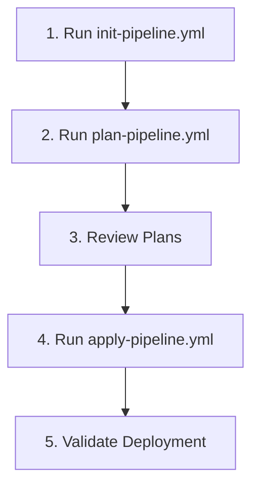
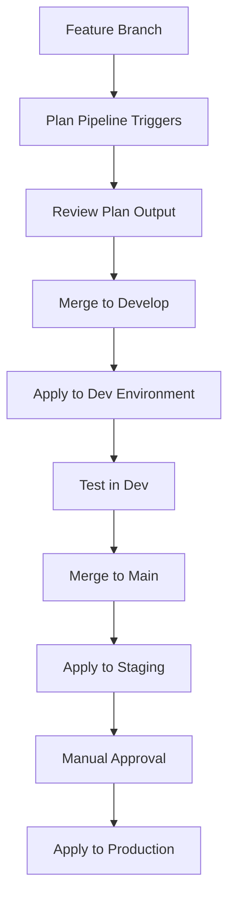

# Azure DevOps Pipeline Implementation Guide
## TRL Hub and Spoke Infrastructure - Complete Setup Guide

This guide provides step-by-step instructions for implementing Azure DevOps pipelines for the TRL Hub and Spoke infrastructure project across multiple Azure subscriptions.

## Table of Contents

1. [Azure Subscriptions Setup](#azure-subscriptions-setup)
2. [Azure DevOps Project Setup](#azure-devops-project-setup)
3. [Service Connections Configuration](#service-connections-configuration)
4. [Agent Pools Setup](#agent-pools-setup)
5. [Environment Configuration](#environment-configuration)
6. [Variable Groups and Key Vault Integration](#variable-groups-and-key-vault-integration)
7. [Pipeline Implementation](#pipeline-implementation)
8. [Build Agents Configuration](#build-agents-configuration)
9. [Parallel Jobs Setup](#parallel-jobs-setup)
10. [Testing and Validation](#testing-and-validation)

## Azure Subscriptions Setup

### Subscription Overview

This project uses three dedicated Azure subscriptions following TRL naming convention:

| Environment | Subscription Name | Subscription ID Pattern | Purpose |
|-------------|------------------|------------------------|---------|
| **Development** | `Sub-TRL-dev-weu` | `xxxxxxxx-xxxx-xxxx-xxxx-xxxxxxxxxxxx` | Development workloads and testing |
| **Staging** | `Sub-TRL-int-weu` | `xxxxxxxx-xxxx-xxxx-xxxx-xxxxxxxxxxxx` | Integration testing and pre-production |
| **Production** | `Sub-TRL-prod-weu` | `xxxxxxxx-xxxx-xxxx-xxxx-xxxxxxxxxxxx` | Production workloads |

### Step 1: Verify Subscription Access

1. **Login to Azure Portal**: https://portal.azure.com
2. **Verify Subscription Access**:
   ```bash
   # Login to Azure CLI
   az login
   
   # List available subscriptions
   az account list --output table
   
   # Verify access to each subscription
   az account set --subscription "Sub-TRL-dev-weu"
   az account show
   
   az account set --subscription "Sub-TRL-int-weu"
   az account show
   
   az account set --subscription "Sub-TRL-prod-weu"
   az account show
   ```

3. **Verify Required Permissions**:
   - **Contributor** role on all three subscriptions
   - **User Access Administrator** for service principal creation
   - **Key Vault Administrator** for secret management

### Step 2: Create Resource Groups for Terraform State

Create storage for Terraform state files in each subscription:

```bash
# Development Subscription
az account set --subscription "Sub-TRL-dev-weu"
az group create --name "trl-hubspoke-dev-tfstate-rg" --location "West Europe"

# Staging Subscription  
az account set --subscription "Sub-TRL-int-weu"
az group create --name "trl-hubspoke-staging-tfstate-rg" --location "West Europe"

# Production Subscription
az account set --subscription "Sub-TRL-prod-weu"
az group create --name "trl-hubspoke-prod-tfstate-rg" --location "West Europe"
```

## Azure DevOps Project Setup

### Step 1: Create Azure DevOps Organization

1. **Navigate to Azure DevOps**: https://dev.azure.com
2. **Create New Organization**:
   - Organization name: `TRL-Infrastructure`
   - Region: `West Europe` (to match Azure region)
   - Click **Continue**

   

### Step 2: Create Azure DevOps Project

1. **Create New Project**:
   - Project name: `TRL-HubSpoke-Infrastructure`
   - Description: `Hub and Spoke network topology infrastructure using Terraform`
   - Visibility: `Private`
   - Version control: `Git`
   - Work item process: `Agile`

   

2. **Initialize Repository**:
   - Navigate to **Repos** > **Files**
   - Clone the repository locally
   - Add your Terraform code structure

### Step 3: Configure Project Settings

1. **Navigate to Project Settings**:
   - Click gear icon in bottom left
   - Select **Project Settings**

2. **Configure General Settings**:
   - **Security**: Enable branch policies
   - **Repositories**: Set default branch to `main`
   - **Boards**: Configure work item types if needed

## Service Connections Configuration

### Step 1: Create Service Principals for Each Subscription

Create dedicated service principals for each environment:

```bash
# Development Environment Service Principal
az account set --subscription "Sub-TRL-dev-weu"
az ad sp create-for-rbac \
  --name "sp-trl-hubspoke-dev" \
  --role "Contributor" \
  --scopes "/subscriptions/$(az account show --query id -o tsv)"

# Staging Environment Service Principal  
az account set --subscription "Sub-TRL-int-weu"
az ad sp create-for-rbac \
  --name "sp-trl-hubspoke-staging" \
  --role "Contributor" \
  --scopes "/subscriptions/$(az account show --query id -o tsv)"

# Production Environment Service Principal
az account set --subscription "Sub-TRL-prod-weu"
az ad sp create-for-rbac \
  --name "sp-trl-hubspoke-prod" \
  --role "Contributor" \
  --scopes "/subscriptions/$(az account show --query id -o tsv)"
```

**Note**: Save the output from each command - you'll need the `appId`, `password`, and `tenant` values.

### Step 2: Create Service Connections in Azure DevOps

1. **Navigate to Service Connections**:
   - Go to **Project Settings** > **Service connections**
   - Click **Create service connection**

   

2. **Create Development Service Connection**:
   - **Connection type**: `Azure Resource Manager`
   - **Authentication method**: `Service principal (manual)`
   - **Scope level**: `Subscription`
   - **Subscription details**:
     - Subscription ID: `Sub-TRL-dev-weu subscription ID`
     - Subscription Name: `Sub-TRL-dev-weu`
   - **Service Principal details**:
     - Service Principal Id: `appId from dev SP creation`
     - Service Principal Key: `password from dev SP creation`
     - Tenant ID: `tenant from dev SP creation`
   - **Service connection name**: `trl-hubspoke-dev-connection`
   - **Security**: Grant access permission to all pipelines
   - Click **Verify and save**

3. **Create Staging Service Connection**:
   - Repeat above steps with staging subscription details
   - **Service connection name**: `trl-hubspoke-staging-connection`
   - Use staging service principal credentials

4. **Create Production Service Connection**:
   - Repeat above steps with production subscription details
   - **Service connection name**: `trl-hubspoke-prod-connection`
   - Use production service principal credentials

### Step 3: Additional Service Principal Permissions

Grant additional permissions for Key Vault and other services:

```bash
# Development Environment
az account set --subscription "Sub-TRL-dev-weu"
DEV_SP_ID=$(az ad sp list --display-name "sp-trl-hubspoke-dev" --query "[0].appId" -o tsv)
az role assignment create --assignee $DEV_SP_ID --role "Key Vault Administrator" --scope "/subscriptions/$(az account show --query id -o tsv)"

# Staging Environment
az account set --subscription "Sub-TRL-int-weu"
STAGING_SP_ID=$(az ad sp list --display-name "sp-trl-hubspoke-staging" --query "[0].appId" -o tsv)
az role assignment create --assignee $STAGING_SP_ID --role "Key Vault Administrator" --scope "/subscriptions/$(az account show --query id -o tsv)"

# Production Environment
az account set --subscription "Sub-TRL-prod-weu"
PROD_SP_ID=$(az ad sp list --display-name "sp-trl-hubspoke-prod" --query "[0].appId" -o tsv)
az role assignment create --assignee $PROD_SP_ID --role "Key Vault Administrator" --scope "/subscriptions/$(az account show --query id -o tsv)"
```

## Agent Pools Setup

### Step 1: Create Agent Pools

1. **Navigate to Agent Pools**:
   - Go to **Project Settings** > **Agent pools**
   - Click **Add pool**

   

2. **Create Development Agent Pool**:
   - **Pool type**: `Self-hosted`
   - **Name**: `trl-hubspoke-dev-pool`
   - **Description**: `Self-hosted agents for development environment`
   - **Grant access permission to all pipelines**: :)
   - Click **Create**

3. **Create Staging Agent Pool**:
   - **Pool type**: `Self-hosted`
   - **Name**: `trl-hubspoke-staging-pool` 
   - **Description**: `Self-hosted agents for staging environment`
   - **Grant access permission to all pipelines**: :)
   - Click **Create**

4. **Create Production Agent Pool**:
   - **Pool type**: `Self-hosted`
   - **Name**: `trl-hubspoke-prod-pool`
   - **Description**: `Self-hosted agents for production environment`
   - **Grant access permission to all pipelines**: :)
   - Click **Create**

### Step 2: Configure Microsoft-Hosted Agents (Alternative)

If using Microsoft-hosted agents instead:

1. **Use Built-in Pools**:
   - `Azure Pipelines` (ubuntu-latest, windows-latest, macOS-latest)
   - No additional setup required
   - Limited to 1,800 minutes per month for free accounts

2. **Purchase Additional Parallel Jobs** (if needed):
   - Navigate to **Organization Settings** > **Billing**
   - Purchase additional parallel jobs for Microsoft-hosted agents

## Environment Configuration

### Step 1: Create Environments

1. **Navigate to Environments**:
   - Go to **Pipelines** > **Environments**
   - Click **New environment**

   

2. **Create Development Environment**:
   - **Name**: `trl-hubspoke-dev`
   - **Description**: `Development environment for TRL Hub and Spoke infrastructure`
   - **Resource**: `None` (virtual environment)
   - Click **Create**

3. **Create Staging Environment**:
   - **Name**: `trl-hubspoke-staging`
   - **Description**: `Staging environment for TRL Hub and Spoke infrastructure`
   - **Resource**: `None`
   - Click **Create**

4. **Create Production Environment**:
   - **Name**: `trl-hubspoke-prod`
   - **Description**: `Production environment for TRL Hub and Spoke infrastructure`
   - **Resource**: `None`
   - Click **Create**

### Step 2: Configure Environment Protection Rules

#### Development Environment:
- **Approvals**: None (automatic deployment)
- **Branch control**: Any branch
- **Business hours**: Not required

#### Staging Environment:
- **Approvals**: None (automatic after dev success)
- **Branch control**: `main` and `develop` branches only
- **Business hours**: Not required

#### Production Environment:
1. **Configure Approvals**:
   - Click on **Production environment** > **Approvals and checks**
   - Add **Approvals**:
     - **Approvers**: Add infrastructure team members
     - **Minimum number of approvers**: 2
     - **Requester can approve**: :( (disabled)
     - **Timeout**: 30 days

   

2. **Configure Branch Control**:
   - Add **Branch control**:
     - **Allowed branches**: `main` branch only
     - Click **Save**

3. **Configure Business Hours** (optional):
   - Add **Business hours**:
     - **Time zone**: `(UTC+01:00) Amsterdam, Berlin, Bern, Rome, Stockholm, Vienna`
     - **Working days**: Monday to Friday
     - **Start time**: 09:00
     - **End time**: 17:00

## Variable Groups and Key Vault Integration

### Step 1: Create Key Vaults for Each Environment

```bash
# Development Key Vault
az account set --subscription "Sub-TRL-dev-weu"
az keyvault create \
  --name "trl-hubspoke-dev-kv-secrets" \
  --resource-group "trl-hubspoke-dev-tfstate-rg" \
  --location "West Europe" \
  --enable-rbac-authorization true

# Staging Key Vault
az account set --subscription "Sub-TRL-int-weu"
az keyvault create \
  --name "trl-hubspoke-staging-kv-secrets" \
  --resource-group "trl-hubspoke-staging-tfstate-rg" \
  --location "West Europe" \
  --enable-rbac-authorization true

# Production Key Vault
az account set --subscription "Sub-TRL-prod-weu"
az keyvault create \
  --name "trl-hubspoke-prod-kv-secrets" \
  --resource-group "trl-hubspoke-prod-tfstate-rg" \
  --location "West Europe" \
  --enable-rbac-authorization true
```

### Step 2: Store Secrets in Key Vault

Store necessary secrets for each environment:

```bash
# Development secrets
az account set --subscription "Sub-TRL-dev-weu"
az keyvault secret set --vault-name "trl-hubspoke-dev-kv-secrets" --name "subscription-id" --value "Sub-TRL-dev-weu-subscription-id"
az keyvault secret set --vault-name "trl-hubspoke-dev-kv-secrets" --name "tenant-id" --value "your-tenant-id"

# Staging secrets
az account set --subscription "Sub-TRL-int-weu"
az keyvault secret set --vault-name "trl-hubspoke-staging-kv-secrets" --name "subscription-id" --value "Sub-TRL-int-weu-subscription-id"
az keyvault secret set --vault-name "trl-hubspoke-staging-kv-secrets" --name "tenant-id" --value "your-tenant-id"

# Production secrets
az account set --subscription "Sub-TRL-prod-weu"
az keyvault secret set --vault-name "trl-hubspoke-prod-kv-secrets" --name "subscription-id" --value "Sub-TRL-prod-weu-subscription-id"
az keyvault secret set --vault-name "trl-hubspoke-prod-kv-secrets" --name "tenant-id" --value "your-tenant-id"
```

### Step 3: Create Variable Groups in Azure DevOps

1. **Navigate to Library**:
   - Go to **Pipelines** > **Library**
   - Click **+ Variable group**

   

2. **Create Development Variable Group**:
   - **Variable group name**: `trl-hubspoke-dev-variables`
   - **Description**: `Variables for development environment`
   - **Link secrets from an Azure key vault**: :) (enabled)
   - **Azure subscription**: Select `trl-hubspoke-dev-connection`
   - **Key vault name**: `trl-hubspoke-dev-kv-secrets`
   - **Authorize**: Click to authorize access
   - **Add secrets**:
     - `subscription-id`
     - `tenant-id`
   - **Pipeline permissions**: Allow access to all pipelines
   - Click **Save**

3. **Create Staging Variable Group**:
   - **Variable group name**: `trl-hubspoke-staging-variables`
   - **Azure subscription**: `trl-hubspoke-staging-connection`
   - **Key vault name**: `trl-hubspoke-staging-kv-secrets`
   - Add same secrets as development

4. **Create Production Variable Group**:
   - **Variable group name**: `trl-hubspoke-prod-variables`
   - **Azure subscription**: `trl-hubspoke-prod-connection`
   - **Key vault name**: `trl-hubspoke-prod-kv-secrets`
   - Add same secrets as development

5. **Create Common Variable Group**:
   - **Variable group name**: `trl-hubspoke-common-variables`
   - **Variables** (not linked to Key Vault):
     - `terraformVersion`: `1.5.7`
     - `azureLocation`: `West Europe`
     - `organizationName`: `TRL`
     - `projectName`: `hubspoke`

## Agent Pools Setup

### Option A: Microsoft-Hosted Agents (Recommended for Start)

**Advantages**:
- No maintenance required
- Always up to date
- Multiple OS options

**Limitations**:
- 1,800 minutes per month for free accounts
- Public IP addresses (firewall rules needed)

**Setup**:
1. **Use Built-in Pools**: No additional setup required
2. **Configure Pipeline YAML**:
   ```yaml
   pool:
     vmImage: 'ubuntu-latest'  # or 'windows-latest', 'macOS-latest'
   ```

### Option B: Self-Hosted Agents (For Production)

**Advantages**:
- Unlimited build minutes
- Private network access
- Custom software installation
- Better security for production

#### Step 1: Prepare Agent VMs

Create VMs for self-hosted agents in each subscription:

```bash
# Create agent VM in development subscription
az account set --subscription "Sub-TRL-dev-weu"
az vm create \
  --resource-group "trl-hubspoke-dev-tfstate-rg" \
  --name "trl-hubspoke-dev-agent-vm" \
  --image "Ubuntu2204" \
  --size "Standard_D2s_v3" \
  --admin-username "azureadmin" \
  --generate-ssh-keys \
  --public-ip-sku "Standard" \
  --nsg-rule "SSH"

# Repeat for staging and production subscriptions
```

#### Step 2: Install Agent Software

1. **Download Agent Package**:
   - Navigate to **Project Settings** > **Agent pools**
   - Select your agent pool
   - Click **New agent**
   - Follow download instructions for your OS

   

2. **Install on Ubuntu VM**:
   ```bash
   # Connect to your VM
   ssh azureadmin@your-vm-ip
   
   # Download and extract agent
   mkdir myagent && cd myagent
   wget https://vstsagentpackage.azureedge.net/agent/3.232.0/vsts-agent-linux-x64-3.232.0.tar.gz
   tar zxvf vsts-agent-linux-x64-3.232.0.tar.gz
   
   # Configure agent
   ./config.sh
   ```

3. **Configuration Parameters**:
   - **Server URL**: `https://dev.azure.com/TRL-Infrastructure`
   - **Authentication type**: `PAT` (Personal Access Token)
   - **Personal Access Token**: Generate from Azure DevOps
   - **Agent pool**: `trl-hubspoke-dev-pool`
   - **Agent name**: `trl-dev-agent-01`
   - **Work folder**: `_work`

4. **Install as Service**:
   ```bash
   sudo ./svc.sh install
   sudo ./svc.sh start
   ```

#### Step 3: Install Required Software on Agents

Install Terraform and Azure CLI on each agent:

```bash
# Install Azure CLI
curl -sL https://aka.ms/InstallAzureCLIDeb | sudo bash

# Install Terraform
wget -O- https://apt.releases.hashicorp.com/gpg | gpg --dearmor | sudo tee /usr/share/keyrings/hashicorp-archive-keyring.gpg
echo "deb [signed-by=/usr/share/keyrings/hashicorp-archive-keyring.gpg] https://apt.releases.hashicorp.com $(lsb_release -cs) main" | sudo tee /etc/apt/sources.list.d/hashicorp.list
sudo apt update && sudo apt install terraform

# Install additional tools
sudo apt install -y git curl unzip jq
pip3 install checkov

# Install tfsec
curl -s https://raw.githubusercontent.com/aquasecurity/tfsec/master/scripts/install_linux.sh | bash
```

## Environment Configuration

### Step 1: Configure Environment-Specific Settings

#### Development Environment (`trl-hubspoke-dev`):

1. **Security Settings**:
   - **Approvals**: None
   - **Branch control**: Any branch allowed
   - **Deployment history retention**: 30 days

2. **Resource Configurations**:
   - **VM Auto-shutdown**: Enabled (19:00 UTC)
   - **Storage Replication**: LRS
   - **SQL Database Tier**: S0 (free tier)
   - **Cosmos DB**: Disabled

#### Staging Environment (`trl-hubspoke-staging`):

1. **Security Settings**:
   - **Approvals**: Optional (team lead approval)
   - **Branch control**: `main` and `develop` branches only
   - **Deployment history retention**: 60 days

2. **Resource Configurations**:
   - **VM Auto-shutdown**: Enabled (20:00 UTC)
   - **Storage Replication**: LRS
   - **SQL Database Tier**: S0
   - **Cosmos DB**: Disabled

#### Production Environment (`trl-hubspoke-prod`):

1. **Security Settings**:
   - **Approvals**: Required (2 approvers minimum)
   - **Branch control**: `main` branch only
   - **Business hours**: Monday-Friday, 09:00-17:00 CET
   - **Deployment history retention**: 365 days

2. **Resource Configurations**:
   - **VM Auto-shutdown**: Disabled
   - **Storage Replication**: GRS
   - **SQL Database Tier**: S1
   - **Cosmos DB**: Enabled

### Step 2: Environment Secrets Configuration

For each environment, configure specific secrets:

1. **Navigate to Environment**:
   - **Pipelines** > **Environments** > Select environment
   - Click **Add resource** > **Generic**

2. **Add Environment Variables**:
   ```yaml
   # Development environment variables
   environment: dev
   vm_auto_shutdown: true
   vm_shutdown_time: "1900"
   storage_replication: "LRS"
   sql_tier: "S0"
   enable_cosmos_db: false
   
   # Staging environment variables  
   environment: staging
   vm_auto_shutdown: true
   vm_shutdown_time: "2000"
   storage_replication: "LRS"
   sql_tier: "S0"
   enable_cosmos_db: false
   
   # Production environment variables
   environment: prod
   vm_auto_shutdown: false
   storage_replication: "GRS"
   sql_tier: "S1"
   enable_cosmos_db: true
   ```

## Variable Groups and Key Vault Integration

### Step 1: Configure Key Vault Integration

1. **Link Variable Groups to Key Vault**:
   - For each variable group created earlier
   - Ensure **Link secrets from an Azure key vault** is enabled
   - Verify service connection has access to Key Vault

2. **Add Required Secrets**:
   
   **Common secrets for all environments**:
   - `tenant-id`: Azure AD tenant ID
   - `vm-admin-username`: Default VM administrator username
   - `sql-admin-username`: SQL Server administrator username

   **Environment-specific secrets**:
   - `subscription-id`: Respective subscription ID for each environment
   - `vm-admin-password`: Auto-generated VM passwords
   - `sql-admin-password`: Auto-generated SQL passwords

### Step 2: Configure Pipeline Variable Groups

Update pipeline YAML to use appropriate variable groups:

```yaml
# Development Pipeline
variables:
  - group: trl-hubspoke-common-variables
  - group: trl-hubspoke-dev-variables

# Staging Pipeline  
variables:
  - group: trl-hubspoke-common-variables
  - group: trl-hubspoke-staging-variables

# Production Pipeline
variables:
  - group: trl-hubspoke-common-variables
  - group: trl-hubspoke-prod-variables
```

## Pipeline Implementation

### Step 1: Create Pipeline Files Structure

Organize pipelines according to the project structure:

```
pipelines/
├── azure-pipelines.yml          # Main deployment pipeline
├── init-pipeline.yml            # Terraform initialization
├── plan-pipeline.yml            # Infrastructure planning
├── apply-pipeline.yml           # Infrastructure deployment
├── destroy-pipeline.yml         # Infrastructure destruction
├── password-rotation.yml        # VM password rotation
└── templates/                   # Reusable pipeline templates
    ├── terraform-init.yml
    ├── terraform-plan.yml
    ├── terraform-apply.yml
    └── security-scan.yml
```

### Step 2: Import Pipelines into Azure DevOps

1. **Create New Pipeline**:
   - Navigate to **Pipelines** > **Pipelines**
   - Click **New pipeline**

   

2. **Select Repository**:
   - Choose **Azure Repos Git**
   - Select your repository: `TRL-HubSpoke-Infrastructure`

3. **Configure Pipeline**:
   - Select **Existing Azure Pipelines YAML file**
   - **Path**: `/pipelines/azure-pipelines.yml`
   - Click **Continue**

4. **Review and Create**:
   - Review the YAML content
   - Click **Save** (don't run yet)
   - **Pipeline name**: `TRL-HubSpoke-Main-Deployment`

5. **Repeat for All Pipelines**:
   - **Initialize Pipeline**: `/pipelines/init-pipeline.yml`
   - **Plan Pipeline**: `/pipelines/plan-pipeline.yml`
   - **Apply Pipeline**: `/pipelines/apply-pipeline.yml`
   - **Destroy Pipeline**: `/pipelines/destroy-pipeline.yml`

### Step 3: Configure Pipeline Triggers

Update each pipeline with appropriate triggers:

```yaml
# Main Deployment Pipeline
trigger:
  branches:
    include:
    - main
  paths:
    include:
    - modules/
    - workspaces/

# Plan Pipeline  
trigger:
  branches:
    include:
    - main
    - develop
    - feature/*
  paths:
    include:
    - modules/
    - workspaces/

# Apply Pipeline
trigger: none  # Manual only

# Destroy Pipeline
trigger: none  # Manual only
```

## Build Agents Configuration

### Microsoft-Hosted Agents Setup

1. **Configure Agent Specifications**:
   ```yaml
   # For Linux workloads
   pool:
     vmImage: 'ubuntu-latest'
   
   # For Windows workloads
   pool:
     vmImage: 'windows-latest'
   
   # For macOS workloads (if needed)
   pool:
     vmImage: 'macOS-latest'
   ```

2. **Agent Capabilities**:
   - **Pre-installed software**: Terraform, Azure CLI, PowerShell, Git
   - **Available tools**: Docker, Node.js, Python, .NET
   - **Agent specifications**: 2 vCPUs, 7GB RAM, 14GB SSD

### Self-Hosted Agents Setup (Advanced)

#### Step 1: Agent VM Specifications

**Recommended VM sizes per environment**:

| Environment | VM Size | vCPUs | RAM | Storage | Purpose |
|-------------|---------|-------|-----|---------|---------|
| Development | Standard_D2s_v3 | 2 | 8GB | 16GB SSD | Basic builds and tests |
| Staging | Standard_D4s_v3 | 4 | 16GB | 32GB SSD | Integration testing |
| Production | Standard_D8s_v3 | 8 | 32GB | 64GB SSD | Production deployments |

#### Step 2: Network Configuration for Self-Hosted Agents

```bash
# Create NSG rules for agent access
az network nsg rule create \
  --resource-group "trl-hubspoke-dev-tfstate-rg" \
  --nsg-name "trl-hubspoke-dev-nsg-agents" \
  --name "AllowHTTPS" \
  --priority 100 \
  --source-address-prefixes "*" \
  --destination-port-ranges 443 \
  --protocol Tcp \
  --access Allow

# Allow Azure DevOps services
az network nsg rule create \
  --resource-group "trl-hubspoke-dev-tfstate-rg" \
  --nsg-name "trl-hubspoke-dev-nsg-agents" \
  --name "AllowAzureDevOps" \
  --priority 110 \
  --source-address-prefixes "AzureCloud" \
  --destination-port-ranges 443 \
  --protocol Tcp \
  --access Allow
```

#### Step 3: Agent Registration Script

Create automated agent registration script:

```bash
#!/bin/bash
# Agent Registration Script

AGENT_NAME="trl-dev-agent-01"
POOL_NAME="trl-hubspoke-dev-pool"
PAT_TOKEN="your-personal-access-token"
ORG_URL="https://dev.azure.com/TRL-Infrastructure"

# Download and configure agent
mkdir /opt/agent && cd /opt/agent
wget https://vstsagentpackage.azureedge.net/agent/3.232.0/vsts-agent-linux-x64-3.232.0.tar.gz
tar zxvf vsts-agent-linux-x64-3.232.0.tar.gz

# Configure agent with parameters
./config.sh \
  --unattended \
  --url "$ORG_URL" \
  --auth pat \
  --token "$PAT_TOKEN" \
  --pool "$POOL_NAME" \
  --agent "$AGENT_NAME" \
  --acceptTeeEula

# Install and start service
sudo ./svc.sh install
sudo ./svc.sh start
```

## Parallel Jobs Setup

### Step 1: Configure Parallel Jobs

1. **Check Current Parallel Jobs**:
   - Navigate to **Organization Settings** > **Billing**
   - View **Parallel jobs** section

   

2. **Free Tier Allocations**:
   - **Microsoft-hosted**: 1 parallel job (1,800 minutes/month)
   - **Self-hosted**: 1 parallel job (unlimited minutes)

3. **Purchase Additional Parallel Jobs** (if needed):
   - Click **Purchase parallel jobs**
   - **Microsoft-hosted**: $40/month per parallel job
   - **Self-hosted**: $15/month per parallel job

### Step 2: Configure Pipeline Parallelism

#### Strategy 1: Environment-Based Parallelism

```yaml
jobs:
- job: DeployAllEnvironments
  strategy:
    parallel: 3  # Deploy to 3 environments in parallel
    matrix:
      dev:
        environmentName: 'dev'
        serviceConnection: 'trl-hubspoke-dev-connection'
      staging:
        environmentName: 'staging'
        serviceConnection: 'trl-hubspoke-staging-connection'
      prod:
        environmentName: 'prod'
        serviceConnection: 'trl-hubspoke-prod-connection'
```

#### Strategy 2: Component-Based Parallelism

```yaml
jobs:
- job: DeployNetwork
  displayName: 'Deploy Network Components'
  pool:
    vmImage: 'ubuntu-latest'

- job: DeployCompute
  displayName: 'Deploy Compute Components'
  dependsOn: DeployNetwork
  pool:
    vmImage: 'ubuntu-latest'

- job: DeployStorage
  displayName: 'Deploy Storage Components'
  dependsOn: DeployNetwork
  pool:
    vmImage: 'ubuntu-latest'
```

### Step 3: Optimize Pipeline Performance

1. **Use Pipeline Caching**:
   ```yaml
   - task: Cache@2
     inputs:
       key: 'terraform | "$(Agent.OS)" | modules/**/*.tf'
       path: '$(Pipeline.Workspace)/.terraform'
       cacheHitVar: 'TERRAFORM_CACHE_RESTORED'
   ```

2. **Parallel Terraform Operations**:
   ```yaml
   - task: AzureCLI@2
     displayName: 'Parallel Terraform Validation'
     inputs:
       azureSubscription: $(serviceConnection)
       scriptType: 'bash'
       scriptLocation: 'inlineScript'
       inlineScript: |
         # Run validation in parallel for all workspaces
         (cd workspaces/hub && terraform validate) &
         (cd workspaces/management && terraform validate) &
         (cd workspaces/spokes/dev && terraform validate) &
         wait
   ```

## Pipeline Execution Order

### Step 1: Initial Setup Sequence



### Step 2: Development Workflow



### Step 3: Pipeline Scheduling

#### Automated Schedules:
```yaml
# Development - Daily deployment
schedules:
- cron: "0 6 * * 1-5"  # 6 AM weekdays
  displayName: Daily dev deployment
  branches:
    include:
    - develop
  always: false

# Staging - Weekly deployment  
schedules:
- cron: "0 8 * * 1"    # 8 AM Mondays
  displayName: Weekly staging deployment
  branches:
    include:
    - main
  always: false

# Production - Manual only (no schedule)
```

## Password Rotation Pipeline

### Step 1: Create Password Rotation Pipeline

```yaml
# File: pipelines/password-rotation.yml
trigger: none  # Manual trigger only

schedules:
- cron: "0 2 1 */3 *"  # First day of quarter at 2 AM
  displayName: Quarterly password rotation
  branches:
    include:
    - main
  always: false

variables:
  - group: trl-hubspoke-common-variables

jobs:
- job: RotatePasswords
  displayName: 'Rotate VM Passwords'
  pool:
    vmImage: 'ubuntu-latest'
  
  strategy:
    matrix:
      dev:
        environmentName: 'dev'
        serviceConnection: 'trl-hubspoke-dev-connection'
        keyVaultName: 'trl-hubspoke-dev-kv-secrets'
      staging:
        environmentName: 'staging'
        serviceConnection: 'trl-hubspoke-staging-connection'
        keyVaultName: 'trl-hubspoke-staging-kv-secrets'
      prod:
        environmentName: 'prod'
        serviceConnection: 'trl-hubspoke-prod-connection'
        keyVaultName: 'trl-hubspoke-prod-kv-secrets'
  
  steps:
  - task: AzureCLI@2
    displayName: 'Rotate $(environmentName) VM Passwords'
    inputs:
      azureSubscription: $(serviceConnection)
      scriptType: 'bash'
      scriptLocation: 'scriptPath'
      scriptPath: 'scripts/vm-password-rotation.sh'
      arguments: '-k $(keyVaultName) -r trl-hubspoke-$(environmentName)-rg-hub -s $(subscription-id) -e $(environmentName) -f'
```

## Testing and Validation

### Step 1: Pipeline Testing Strategy

1. **Unit Testing**:
   ```bash
   # Terraform validation
   terraform validate
   terraform fmt -check
   ```

2. **Security Testing**:
   ```bash
   # Security scans
   tfsec modules/
   checkov -d modules/
   ```

3. **Integration Testing**:
   ```bash
   # Test deployment in dev environment
   cd workspaces/spokes/dev
   terraform plan
   terraform apply -auto-approve
   terraform destroy -auto-approve
   ```

### Step 2: Pipeline Monitoring

1. **Configure Alerts**:
   - **Pipeline failure notifications**
   - **Long-running pipeline alerts**
   - **Cost threshold alerts**

2. **Dashboard Setup**:
   - Create Azure DevOps dashboard
   - Add pipeline status widgets
   - Monitor deployment frequency

### Step 3: Troubleshooting Common Issues

#### Issue 1: Service Connection Authentication
```bash
# Verify service principal permissions
az role assignment list --assignee service-principal-id
```

#### Issue 2: Key Vault Access
```bash
# Check Key Vault permissions
az keyvault show --name vault-name --resource-group rg-name
```

#### Issue 3: Terraform State Lock
```bash
# Force unlock if needed (use carefully)
terraform force-unlock lock-id
```

## Implementation Checklist

### Pre-Implementation:
- [ ] Azure subscriptions created and accessible
- [ ] Azure DevOps organization and project created
- [ ] Service principals created for each subscription
- [ ] Key Vaults created and configured
- [ ] Required permissions assigned

### Azure DevOps Configuration:
- [ ] Service connections created and tested
- [ ] Variable groups linked to Key Vault
- [ ] Environments created with approval rules
- [ ] Agent pools configured
- [ ] Parallel jobs purchased (if needed)

### Pipeline Setup:
- [ ] Repository structure created
- [ ] Pipeline YAML files committed
- [ ] Pipelines imported into Azure DevOps
- [ ] Pipeline triggers configured
- [ ] Environment variables set

### Testing:
- [ ] Run init-pipeline to setup backend
- [ ] Run plan-pipeline to validate configuration
- [ ] Run apply-pipeline for dev environment
- [ ] Validate infrastructure deployment
- [ ] Test password rotation script

### Production Readiness:
- [ ] Staging environment tested
- [ ] Production approval process configured
- [ ] Monitoring and alerting setup
- [ ] Documentation completed
- [ ] Team training completed

## Next Steps

1. **Initialize Infrastructure**:
   ```bash
   # Run initialization pipeline
   az pipelines run --name "TRL-HubSpoke-Init"
   ```

2. **Plan Infrastructure**:
   ```bash
   # Run planning pipeline
   az pipelines run --name "TRL-HubSpoke-Plan"
   ```

3. **Deploy Infrastructure**:
   ```bash
   # Run apply pipeline (will require approvals for production)
   az pipelines run --name "TRL-HubSpoke-Apply"
   ```

4. **Monitor and Maintain**:
   - Set up regular password rotation schedule
   - Monitor cost and usage
   - Review security scans
   - Update infrastructure as needed

## Support and Resources

- **Azure DevOps Documentation**: https://docs.microsoft.com/en-us/azure/devops/
- **Azure Pipelines Agents**: https://docs.microsoft.com/en-us/azure/devops/pipelines/agents/
- **Service Connections**: https://docs.microsoft.com/en-us/azure/devops/pipelines/library/service-endpoints
- **Variable Groups**: https://docs.microsoft.com/en-us/azure/devops/pipelines/library/variable-groups
- **Environments**: https://docs.microsoft.com/en-us/azure/devops/pipelines/process/environments

This implementation guide provides a complete roadmap for setting up enterprise-grade Azure DevOps pipelines for your TRL Hub and Spoke infrastructure with proper security, approval workflows, and automation capabilities.
