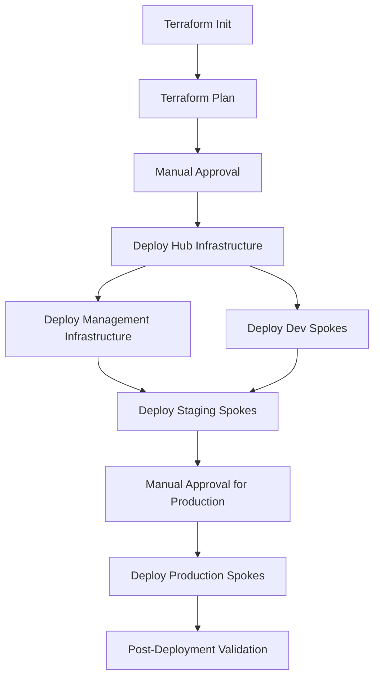

# Azure-DevOps
Azure DevOps is a cloud-based platform that provides integrated tools for software development teams. It includes everything you need to plan work, collaborate on code, build applications, test functionality, and deploy to production.

# Azure DevOps Hub and Spoke Infrastructure with Terraform

This project implements a secure Hub and Spoke network topology in Azure using Terraform, with all traffic routing through Azure Firewall and utilizing Azure free tier services.

## TRL Naming Convention

This project follows the standardized TRL naming convention: `<org>-<project>-<env>-<resourceType>[-<suffix>]`

- **Organization**: `trl`
- **Project**: `Azure.IAC.hubspoke` 
- **Environment**: `dev`, `staging`, `prod`
- **Resource Type**: See abbreviations table below
- **Suffix**: Optional descriptive suffix (e.g., `main`, `01`, `web`)

## Azure Resources and Naming Conventions

### Core Infrastructure

| Resource Type | Abbreviation | Max Length | Allowed Characters | Example |
|---------------|--------------|------------|-------------------|---------|
| Resource Group | `rg` | 90 | Alphanumeric, underscore, parentheses, hyphen, period | `trl-hubspoke-prod-rg-hub` |
| Virtual Network | `vnet` | 64 | Alphanumeric, underscore, hyphen, period | `trl-hubspoke-prod-vnet-hub` |
| Subnet | `snet` | 80 | Alphanumeric, underscore, hyphen, period | `trl-hubspoke-prod-snet-workload` |
| Network Interface | `nic` | 80 | Alphanumeric, underscore, hyphen, period | `trl-hubspoke-prod-nic-vm01` |
| Public IP | `pip` | 80 | Alphanumeric, underscore, hyphen, period | `trl-hubspoke-prod-pip-afw` |
| Load Balancer | `lb` | 80 | Alphanumeric, underscore, hyphen, period | `trl-hubspoke-prod-lb-web` |
| Application Gateway | `agw` | 80 | Alphanumeric, underscore, hyphen, period | `trl-hubspoke-prod-agw-web` |
| Traffic Manager | `tm` | 63 | Alphanumeric, hyphen | `trl-hubspoke-prod-tm` |
| Front Door | `fd` | 64 | Alphanumeric, hyphen | `trl-hubspoke-prod-fd` |
| CDN Profile | `cdnp` | 260 | Alphanumeric, hyphen | `trl-hubspoke-prod-cdnp` |
| CDN Endpoint | `cdne` | 50 | Alphanumeric, hyphen | `trl-hubspoke-prod-cdne` |
| Express Route | `er` | 80 | Alphanumeric, underscore, hyphen, period | `trl-hubspoke-prod-er` |
| VPN Gateway | `vpng` | 80 | Alphanumeric, underscore, hyphen, period | `trl-hubspoke-prod-vpng` |
| Local Network Gateway | `lgw` | 80 | Alphanumeric, underscore, hyphen, period | `trl-hubspoke-prod-lgw` |
| Virtual Network Gateway | `vgw` | 80 | Alphanumeric, underscore, hyphen, period | `trl-hubspoke-prod-vgw` |

### Security & Identity

| Resource Type | Abbreviation | Max Length | Allowed Characters | Example |
|---------------|--------------|------------|-------------------|---------|
| Network Security Group | `nsg` | 80 | Alphanumeric, underscore, hyphen, period | `trl-hubspoke-prod-nsg-web` |
| Route Table | `rt` | 80 | Alphanumeric, underscore, hyphen, period | `trl-hubspoke-prod-rt-spoke1` |
| Azure Firewall | `afw` | 80 | Alphanumeric, underscore, hyphen, period | `trl-hubspoke-prod-afw` |
| Firewall Policy | `afwp` | 80 | Alphanumeric, underscore, hyphen, period | `trl-hubspoke-prod-afwp` |
| Bastion | `bas` | 80 | Alphanumeric, underscore, hyphen, period | `trl-hubspoke-prod-bas` |
| Key Vault | `kv` | 24 | Alphanumeric, hyphen | `trl-hubspoke-prod-kv` |
| Private Endpoint | `pep` | 80 | Alphanumeric, underscore, hyphen, period | `trl-hubspoke-prod-pep-sql` |
| Private DNS Zone | `pdns` | 63 | Alphanumeric, hyphen, period | `privatelink.database.windows.net` |
| User Assigned Identity | `id` | 128 | Alphanumeric, underscore, hyphen | `trl-hubspoke-prod-id-vm` |
| Network Watcher | `nw` | 80 | Alphanumeric, underscore, hyphen, period | `trl-hubspoke-prod-nw` |
| DDoS Protection Plan | `ddos` | 80 | Alphanumeric, underscore, hyphen, period | `trl-hubspoke-prod-ddos` |
| Web Application Firewall | `waf` | 80 | Alphanumeric, underscore, hyphen, period | `trl-hubspoke-prod-waf` |

### Compute & Web

| Resource Type | Abbreviation | Max Length | Allowed Characters | Example |
|---------------|--------------|------------|-------------------|---------|
| Virtual Machine | `vm` | 64 (Win), 15 (Linux) | Alphanumeric, hyphen | `trl-hubspoke-prod-vm-web01` |
| VM Scale Set | `vmss` | 64 (Win), 15 (Linux) | Alphanumeric, hyphen | `trl-hubspoke-prod-vmss-web` |
| Availability Set | `avail` | 80 | Alphanumeric, underscore, hyphen, period | `trl-hubspoke-prod-avail-web` |
| Managed Disk | `disk` | 80 | Alphanumeric, underscore, hyphen, period | `trl-hubspoke-prod-disk-vm01-os` |
| Snapshot | `snap` | 80 | Alphanumeric, underscore, hyphen, period | `trl-hubspoke-prod-snap-vm01` |
| Image | `img` | 80 | Alphanumeric, underscore, hyphen, period | `trl-hubspoke-prod-img-web` |
| App Service Plan | `plan` | 40 | Alphanumeric, hyphen | `trl-hubspoke-prod-plan-web` |
| App Service | `app` | 60 | Alphanumeric, hyphen | `trl-hubspoke-prod-app-web` |
| Function App | `func` | 60 | Alphanumeric, hyphen | `trl-hubspoke-prod-func-api` |
| Static Web App | `stapp` | 40 | Alphanumeric, hyphen | `trl-hubspoke-prod-stapp` |
| Logic App | `logic` | 80 | Alphanumeric, underscore, hyphen, period | `trl-hubspoke-prod-logic` |
| Batch Account | `ba` | 24 | Lowercase alphanumeric | `trlhubspokeprodba` |

### Data & Storage

| Resource Type | Abbreviation | Max Length | Allowed Characters | Example |
|---------------|--------------|------------|-------------------|---------|
| Storage Account | `st` | 24 | Lowercase alphanumeric | `trlhubspokeprodst` |
| Storage Container | `stct` | 63 | Lowercase alphanumeric, hyphen | `trl-hubspoke-prod-stct` |
| File Share | `fs` | 63 | Lowercase alphanumeric, hyphen | `trl-hubspoke-prod-fs` |
| Queue | `stq` | 63 | Lowercase alphanumeric, hyphen | `trl-hubspoke-prod-stq` |
| Table | `stt` | 63 | Alphanumeric | `trlhubspokeprodtable` |
| SQL Server | `sql` | 63 | Lowercase alphanumeric, hyphen | `trl-hubspoke-prod-sql` |
| SQL Database | `sqldb` | 128 | Alphanumeric, underscore, hyphen, period | `trl-hubspoke-prod-sqldb-main` |
| SQL Elastic Pool | `sqlep` | 128 | Alphanumeric, underscore, hyphen, period | `trl-hubspoke-prod-sqlep` |
| SQL Managed Instance | `sqlmi` | 63 | Lowercase alphanumeric, hyphen | `trl-hubspoke-prod-sqlmi` |
| Cosmos DB | `cosmos` | 44 | Lowercase alphanumeric, hyphen | `trl-hubspoke-prod-cosmos` |
| Redis Cache | `redis` | 63 | Alphanumeric, hyphen | `trl-hubspoke-prod-redis` |
| MySQL Database | `mysql` | 63 | Lowercase alphanumeric, hyphen | `trl-hubspoke-prod-mysql` |
| PostgreSQL Database | `psql` | 63 | Lowercase alphanumeric, hyphen | `trl-hubspoke-prod-psql` |
| MariaDB Database | `mariadb` | 63 | Lowercase alphanumeric, hyphen | `trl-hubspoke-prod-mariadb` |
| Data Factory | `adf` | 63 | Alphanumeric, hyphen | `trl-hubspoke-prod-adf` |
| Synapse Workspace | `syn` | 45 | Alphanumeric, hyphen | `trl-hubspoke-prod-syn` |
| Analysis Services | `as` | 63 | Lowercase alphanumeric | `trlhubspokeprods` |
| Data Lake Store | `dls` | 24 | Lowercase alphanumeric | `trlhubspokeprodls` |
| Data Lake Analytics | `dla` | 24 | Lowercase alphanumeric | `trlhubspokeprodla` |
| HDInsight Cluster | `hdi` | 59 | Alphanumeric, hyphen | `trl-hubspoke-prod-hdi` |
| Power BI Embedded | `pbi` | 63 | Alphanumeric, hyphen | `trl-hubspoke-prod-pbi` |

### Containers & DevOps

| Resource Type | Abbreviation | Max Length | Allowed Characters | Example |
|---------------|--------------|------------|-------------------|---------|
| Container Registry | `cr` | 50 | Alphanumeric | `trlhubspokeprodcr` |
| Kubernetes Service | `aks` | 63 | Alphanumeric, hyphen | `trl-hubspoke-prod-aks` |
| Container Instance | `ci` | 63 | Lowercase alphanumeric, hyphen | `trl-hubspoke-prod-ci-web` |
| Container App | `ca` | 32 | Lowercase alphanumeric, hyphen | `trl-hubspoke-prod-ca` |
| Service Fabric Cluster | `sf` | 23 | Lowercase alphanumeric | `trlhubspokeprodcluster` |
| Service Bus Namespace | `sb` | 50 | Alphanumeric, hyphen | `trl-hubspoke-prod-sb` |
| Service Bus Queue | `sbq` | 50 | Alphanumeric, hyphen, underscore, period | `trl-hubspoke-prod-sbq-orders` |
| Service Bus Topic | `sbt` | 50 | Alphanumeric, hyphen, underscore, period | `trl-hubspoke-prod-sbt-events` |
| Event Hub Namespace | `evhns` | 50 | Alphanumeric, hyphen | `trl-hubspoke-prod-evhns` |
| Event Hub | `evh` | 50 | Alphanumeric, hyphen, underscore, period | `trl-hubspoke-prod-evh-logs` |
| Event Grid Domain | `egd` | 50 | Alphanumeric, hyphen | `trl-hubspoke-prod-egd` |
| Event Grid Topic | `egt` | 50 | Alphanumeric, hyphen | `trl-hubspoke-prod-egt` |
| IoT Hub | `iot` | 50 | Alphanumeric, hyphen | `trl-hubspoke-prod-iot` |
| Notification Hub | `ntf` | 260 | Alphanumeric, hyphen | `trl-hubspoke-prod-ntf` |
| DevTest Lab | `dtl` | 50 | Alphanumeric, hyphen | `trl-hubspoke-prod-dtl` |

### Monitoring & Management

| Resource Type | Abbreviation | Max Length | Allowed Characters | Example |
|---------------|--------------|------------|-------------------|---------|
| Log Analytics Workspace | `log` | 63 | Alphanumeric, hyphen | `trl-hubspoke-prod-log` |
| Application Insights | `appi` | 260 | Unicode characters | `trl-hubspoke-prod-appi-web` |
| Action Group | `ag` | 260 | Unicode characters | `trl-hubspoke-prod-ag` |
| Alert Rule | `ar` | 260 | Unicode characters | `trl-hubspoke-prod-ar` |
| Recovery Services Vault | `rsv` | 50 | Alphanumeric, hyphen | `trl-hubspoke-prod-rsv` |
| Backup Vault | `bv` | 50 | Alphanumeric, hyphen | `trl-hubspoke-prod-bv` |
| Site Recovery Vault | `srv` | 50 | Alphanumeric, hyphen | `trl-hubspoke-prod-srv` |
| Automation Account | `aa` | 50 | Alphanumeric, hyphen | `trl-hubspoke-prod-aa` |
| Managed Grafana | `amg` | 23 | Alphanumeric, hyphen | `trl-hubspoke-prod-amg` |
| Dashboard | `dash` | 160 | Unicode characters | `trl-hubspoke-prod-dash` |
| Workbook | `wb` | 260 | Unicode characters | `trl-hubspoke-prod-wb` |
| Policy Definition | `policy` | 128 | Unicode characters | `trl-hubspoke-prod-policy-deny-pip` |
| Policy Assignment | `assign` | 128 | Unicode characters | `trl-hubspoke-prod-assign-deny-pip` |
| Blueprint | `bp` | 48 | Alphanumeric, hyphen, underscore, period | `trl-hubspoke-prod-bp` |
| Management Group | `mg` | 90 | Alphanumeric, underscore, parentheses, hyphen, period | `trl-hubspoke-prod-mg` |

### AI & Cognitive Services

| Resource Type | Abbreviation | Max Length | Allowed Characters | Example |
|---------------|--------------|------------|-------------------|---------|
| Cognitive Services | `cog` | 64 | Alphanumeric, underscore, hyphen, period | `trl-hubspoke-prod-cog-vision` |
| Computer Vision | `cv` | 64 | Alphanumeric, underscore, hyphen, period | `trl-hubspoke-prod-cv` |
| Custom Vision | `cusv` | 64 | Alphanumeric, underscore, hyphen, period | `trl-hubspoke-prod-cusv` |
| Face API | `face` | 64 | Alphanumeric, underscore, hyphen, period | `trl-hubspoke-prod-face` |
| Form Recognizer | `fr` | 64 | Alphanumeric, underscore, hyphen, period | `trl-hubspoke-prod-fr` |
| Language Understanding | `luis` | 64 | Alphanumeric, underscore, hyphen, period | `trl-hubspoke-prod-luis` |
| QnA Maker | `qna` | 64 | Alphanumeric, underscore, hyphen, period | `trl-hubspoke-prod-qna` |
| Speech Service | `speech` | 64 | Alphanumeric, underscore, hyphen, period | `trl-hubspoke-prod-speech` |
| Text Analytics | `ta` | 64 | Alphanumeric, underscore, hyphen, period | `trl-hubspoke-prod-ta` |
| Translator | `trans` | 64 | Alphanumeric, underscore, hyphen, period | `trl-hubspoke-prod-trans` |
| Bot Service | `bot` | 64 | Alphanumeric, underscore, hyphen, period | `trl-hubspoke-prod-bot` |
| Machine Learning Workspace | `mlw` | 260 | Unicode characters | `trl-hubspoke-prod-mlw` |
| Machine Learning Compute | `mlc` | 24 | Alphanumeric, hyphen | `trl-hubspoke-prod-mlc` |
| Search Service | `srch` | 60 | Lowercase alphanumeric, hyphen | `trl-hubspoke-prod-srch` |
| Maps Account | `map` | 98 | Alphanumeric, underscore, hyphen, period | `trl-hubspoke-prod-map` |

### Integration & API

| Resource Type | Abbreviation | Max Length | Allowed Characters | Example |
|---------------|--------------|------------|-------------------|---------|
| API Management | `apim` | 50 | Alphanumeric, hyphen | `trl-hubspoke-prod-apim` |
| Logic App | `logic` | 80 | Alphanumeric, underscore, hyphen, period | `trl-hubspoke-prod-logic` |
| Integration Account | `ia` | 80 | Alphanumeric, underscore, hyphen, period | `trl-hubspoke-prod-ia` |
| Data Factory | `df` | 63 | Alphanumeric, hyphen | `trl-hubspoke-prod-df` |
| Data Factory Pipeline | `dfp` | 260 | Alphanumeric, hyphen, underscore, period | `trl-hubspoke-prod-dfp` |
| Stream Analytics | `asa` | 63 | Alphanumeric, hyphen, underscore | `trl-hubspoke-prod-asa` |
| Power Automate | `flow` | 260 | Unicode characters | `trl-hubspoke-prod-flow` |

### Media & Communication

| Resource Type | Abbreviation | Max Length | Allowed Characters | Example |
|---------------|--------------|------------|-------------------|---------|
| Media Services | `ams` | 24 | Lowercase alphanumeric | `trlhubspokeprodams` |
| Communication Services | `acs` | 63 | Alphanumeric, hyphen | `trl-hubspoke-prod-acs` |
| SignalR Service | `sigr` | 63 | Alphanumeric, hyphen | `trl-hubspoke-prod-sigr` |
| Web PubSub | `wps` | 63 | Alphanumeric, hyphen | `trl-hubspoke-prod-wps` |

## Character Restrictions Summary

### Common Rules:
- **No spaces allowed** in any resource names
- **Case sensitivity varies** by resource type
- **Special characters** are limited and resource-specific
- **Global uniqueness required** for some resources (Storage Accounts, Key Vaults, etc.)

### Character Categories:
- **Alphanumeric**: `a-z`, `A-Z`, `0-9`
- **Hyphen**: `-` (not at start/end for most resources)
- **Underscore**: `_`
- **Period**: `.`
- **Parentheses**: `()`

### Length Considerations:
- Consider the **full naming convention length** when planning
- Leave room for **environment suffixes** and **incremental numbers**
- Some resources have **very short limits** (Storage Accounts: 24 chars)
- Plan for **automated deployments** that might add suffixes

## Architecture Overview

### Hub and Spoke Topology
- **Hub VNet**: Contains shared services (Azure Firewall, Bastion, Key Vault)
- **Spoke VNets**: Contains workload resources (VMs, databases, storage)
- **Azure Firewall**: Centralized security enforcement in West Europe
- **Azure Bastion**: Secure RDP/SSH access without public IPs
- **Key Vault**: Centralized secrets and credential management
- **Private Endpoints**: All Azure PaaS services accessed privately

### Security Features
- No public IPs on VMs
- All traffic routed through Azure Firewall
- Private endpoints for all Azure services
- Azure Bastion for secure remote access
- Key Vault integration for all credentials
- **NO Network Security Groups (NSGs)** - All traffic managed by Azure Firewall

## Step-by-Step Solution Architecture

### Phase 1: Foundation Setup

#### Step 1: Azure Subscription and Resource Groups
```
1. Create Azure subscription (free tier)
2. Set up service principal for Terraform
3. Create resource groups:
   - rg-hub-prod-we (Hub resources)
   - rg-spoke-prod-we (Spoke resources)
   - rg-shared-prod-we (Shared services)
```

#### Step 2: Terraform State Management
```
1. Create storage account for Terraform state
2. Configure backend configuration
3. Set up state locking with blob lease
```

### Phase 2: Network Infrastructure

#### Step 3: Hub Virtual Network
```
1. Create Hub VNet (10.0.0.0/16)
   - AzureFirewallSubnet (10.0.1.0/26)
   - AzureBastionSubnet (10.0.2.0/27)
   - SharedServicesSubnet (10.0.3.0/24)
   - PrivateEndpointSubnet (10.0.4.0/24)
```

#### Step 4: Spoke Virtual Networks
```
1. Create Spoke VNet 1 (10.1.0.0/16)
   - WorkloadSubnet (10.1.1.0/24)
   - DatabaseSubnet (10.1.2.0/24)
   - PrivateEndpointSubnet (10.1.3.0/24)

2. Create Spoke VNet 2 (10.2.0.0/16)
   - WorkloadSubnet (10.2.1.0/24)
   - AppServiceSubnet (10.2.2.0/24)
   - PrivateEndpointSubnet (10.2.3.0/24)
```

#### Step 5: VNet Peering
```
1. Hub to Spoke 1 peering
2. Hub to Spoke 2 peering
3. Configure gateway transit
4. Allow forwarded traffic
```

### Phase 3: Security Infrastructure

#### Step 6: Azure Firewall Deployment
```
1. Create Azure Firewall in Hub VNet
2. Create public IP for Azure Firewall
3. Configure firewall policy
4. Set up application rules
5. Set up network rules
6. Configure NAT rules for management
```

#### Step 7: Route Tables Configuration
```
1. Create route table for spoke subnets
2. Add default route (0.0.0.0/0) to Azure Firewall
3. Associate route tables with spoke subnets
4. Configure hub subnet routing
```

#### Step 8: Network Security Groups
```
1. Create NSGs for each subnet type
2. Configure inbound/outbound rules
3. Associate NSGs with subnets
4. Implement least privilege access
```

### Phase 4: Key Management

#### Step 9: Azure Key Vault Setup
```
1. Create Key Vault in hub network
2. Configure private endpoint
3. Set up access policies
4. Generate VM login credentials
5. Store SSL certificates
6. Configure network access restrictions
```

#### Step 10: Managed Identity Configuration
```
1. Create system-assigned managed identities
2. Configure Key Vault access policies
3. Set up role assignments
4. Test secret retrieval
```

### Phase 5: Compute Resources

#### Step 11: Azure Bastion Deployment
```
1. Create Azure Bastion in hub network
2. Configure Standard SKU for enhanced features
3. Set up IP configurations
4. Test connectivity to spoke VMs
```

#### Step 12: Virtual Machines (Free Tier)
```
1. Deploy B1s VMs in spoke networks (750 hours free)
2. Configure VM extensions for Key Vault
3. Set up automatic credential rotation
4. Install required monitoring agents
```

### Phase 6: Storage and Data Services

#### Step 13: Storage Accounts (Free Tier)
```
1. Create storage accounts with private endpoints
2. Configure LRS replication (5GB free)
3. Set up file shares (1GB free)
4. Implement backup retention policies
```

#### Step 14: Azure SQL Database (Free Tier)
```
1. Deploy SQL Database S0 tier (31 DTU days free)
2. Configure private endpoint
3. Set up database firewall rules
4. Implement backup and recovery
```

#### Step 15: Azure Cosmos DB (Free Tier)
```
1. Create Cosmos DB account (25GB + 1000 RU/s free)
2. Configure private endpoint
3. Set up database and containers
4. Implement backup policies
```

### Phase 7: Application Services

#### Step 16: Container Registry (Free Tier)
```
1. Create Azure Container Registry (31 days free)
2. Configure private endpoint
3. Set up service connection
4. Implement image security scanning
```

#### Step 17: Load Balancer (Free Tier)
```
1. Deploy Standard Load Balancer (5 rules free)
2. Configure backend pools
3. Set up health probes
4. Implement traffic distribution
```

### Phase 8: Monitoring and Governance

#### Step 18: Azure Monitor Setup
```
1. Configure Log Analytics workspace
2. Set up diagnostic settings
3. Create custom dashboards
4. Implement alerting rules
```

#### Step 19: Backup and Recovery
```
1. Create Recovery Services Vault
2. Configure VM backup policies
3. Set up database backup
4. Test restore procedures
```

### Phase 9: DevOps Integration

#### Step 20: Azure DevOps Setup
```
1. Create Azure DevOps organization
2. Set up project and repositories
3. Configure service connections
4. Create build and release pipelines
```

#### Step 21: Terraform Pipeline
```
1. Create Terraform plan pipeline
2. Set up approval gates
3. Configure state file management
4. Implement infrastructure drift detection
```

## Free Tier Services Utilized

### Compute (750 hours/month each)
- Virtual Machines BS Series B1s
- Virtual Machines BS Series Windows B1s
- Virtual Machines Bpsv2 Series B2pts v2
- Virtual Machines Basv2 Series B2ats v2

### Storage (Monthly limits)
- 5GB Hot LRS Blob Storage
- 1GB File Storage LRS
- 32GB Database Storage
- 10GB Archive Storage

### Networking (Monthly limits)
- 15GB Data Transfer Out
- 1,500 Public IP Address Hours
- Standard Load Balancer (5 rules)
- VPN Gateway (750 hours)

### Databases
- SQL Database S0 (31 DTU days)
- Cosmos DB (25GB + 1000 RU/s)
- PostgreSQL/MySQL Flexible Server B1MS (750 hours)

### Security and Management
- Key Vault (10,000 Premium HSM operations)
- Service Bus Standard (750 hours)
- Container Registry Standard (31 days)

## Terraform Structure (Updated)

```
Azure DevOps/
├── modules/                    # Core Terraform module (single module approach)
│   ├── main.tf                # Resource groups and core configuration
│   ├── network.tf             # All networking resources (hub, spokes, routing)
│   ├── security.tf            # Firewall, Bastion, Key Vault
│   ├── compute.tf             # Virtual machines and compute resources
│   ├── storage.tf             # Storage accounts and containers
│   ├── database.tf            # SQL and Cosmos DB resources
│   ├── variables.tf           # All input variables
│   ├── outputs.tf             # All output values
│   ├── locals.tf              # Local values and computed data
│   └── versions.tf            # Provider requirements
├── pipelines/                 # Azure DevOps pipeline configurations
│   ├── azure-pipelines.yml    # Main deployment pipeline
│   ├── destroy-pipeline.yml   # Infrastructure destruction pipeline
│   ├── init-pipeline.yml      # Terraform initialization pipeline
│   ├── plan-pipeline.yml      # Terraform planning pipeline
│   └── apply-pipeline.yml     # Terraform apply pipeline
├── workspaces/                # Terraform workspaces for different deployments
│   ├── hub/                   # Hub infrastructure workspace
│   │   ├── main.tf            # Hub-specific configuration
│   │   ├── variables.tf       # Hub variables
│   │   └── outputs.tf         # Hub outputs
│   ├── management/            # Management infrastructure workspace
│   │   └── main.tf            # Management configuration
│   └── spokes/                # Spoke workspaces by environment
│       ├── dev/               # Development environment
│       │   └── main.tf        # Dev spoke configuration
│       ├── staging/           # Staging environment
│       │   └── main.tf        # Staging spoke configuration
│       └── prod/              # Production environment
│           └── main.tf        # Production spoke configuration
├── README.md                  # Main project documentation
├── CONTRIBUTING.md            # Contribution guidelines
└── PROJECT-STRUCTURE.md       # Detailed project structure documentation
```

## Current Architecture Implementation

### Hub and Spoke Topology with Workspace Isolation

This project implements a **Hub and Spoke network topology** using a **single Terraform module** with **workspace-based deployment** pattern:

#### **1. Hub Infrastructure (`workspaces/hub/`)**
- **Azure Firewall**: Centralized security enforcement in West Europe
- **Azure Bastion**: Secure RDP/SSH access without public IPs
- **Key Vault**: Centralized secrets and credential management
- **Private DNS Zones**: Internal name resolution for all Azure services
- **Hub Virtual Network**: Contains shared services (10.0.0.0/16)
  - AzureFirewallSubnet (10.0.1.0/26)
  - AzureBastionSubnet (10.0.2.0/27)
  - SharedServicesSubnet (10.0.3.0/24)
  - PrivateEndpointSubnet (10.0.4.0/24)

#### **2. Management Infrastructure (`workspaces/management/`)**
- **Monitoring and Governance**: Log Analytics, Application Insights
- **Azure Policies**: Governance and compliance enforcement
- **Backup and Recovery**: Centralized backup management

#### **3. Spoke Infrastructure (`workspaces/spokes/{env}/`)**
- **Environment-Specific Workloads**: Isolated by environment
- **Spoke Virtual Networks**:
  - Spoke 1 (10.1.0.0/16): WorkloadSubnet, DatabaseSubnet, PrivateEndpointSubnet
  - Spoke 2 (10.2.0.0/16): WorkloadSubnet, AppServiceSubnet, PrivateEndpointSubnet
- **Virtual Machines**: Windows VMs with Key Vault integration
- **Storage Services**: Private storage accounts with LRS/GRS replication
- **Database Services**: SQL Database and Cosmos DB with private endpoints

### Security Architecture Features

- **NO Network Security Groups (NSGs)**: All traffic managed by Azure Firewall
- **Private Endpoints**: All Azure PaaS services accessed privately
- **Zero Public IPs**: VMs accessible only through Azure Bastion
- **Centralized Routing**: All traffic routed through Azure Firewall
- **Key Vault Integration**: All credentials stored and accessed securely

### Deployment Workflow



### Environment Configuration

| Environment | VM Size | Auto-Shutdown | Storage Replication | SQL Tier | Cosmos DB |
|-------------|---------|---------------|-------------------|----------|-----------|
| **Dev** | Standard_B1s | 19:00 UTC | LRS | S0 | Disabled |
| **Staging** | Standard_B1s | 20:00 UTC | LRS | S0 | Disabled |
| **Production** | Standard_B2s | Disabled | GRS | S1 | Enabled |

### Pipeline Architecture

#### **1. Main Deployment Pipeline (`azure-pipelines.yml`)**
- **Multi-stage deployment** with proper dependency management
- **Environment isolation** with separate Terraform state files
- **Parallel deployment** where dependencies allow
- **Manual approval gates** for production deployments

#### **2. Specialized Pipelines**
- **init-pipeline.yml**: Terraform initialization and backend setup
- **plan-pipeline.yml**: Infrastructure planning and validation
- **apply-pipeline.yml**: Controlled infrastructure deployment
- **destroy-pipeline.yml**: Safe infrastructure destruction

#### **3. Pipeline Features**
- **Terraform validation** across all configurations
- **Security scanning** with tfsec and Checkov
- **Infrastructure validation** post-deployment
- **Artifact management** for cross-stage dependencies
- **Automated rollback** capabilities

### Free Tier Optimization

This architecture maximizes Azure free tier usage:

#### **Compute Resources** (750 hours/month each)
- Virtual Machines BS Series B1s (Linux/Windows)
- Auto-shutdown schedules for cost optimization
- Right-sizing based on environment needs

#### **Storage Resources** (Monthly limits)
- 5GB Hot LRS Blob Storage
- 1GB File Storage LRS
- Private endpoints for secure access

#### **Database Resources**
- SQL Database S0 (31 DTU days free)
- Cosmos DB (25GB + 1000 RU/s free) - Production only

#### **Networking Resources** (Monthly limits)
- 15GB Data Transfer Out
- 1,500 Public IP Address Hours (Firewall + Bastion only)
- Private connectivity for all services

### Workspace Benefits

#### **1. Environment Isolation**
- **Separate state files** prevent environment interference
- **Independent deployment cycles** for each environment
- **Environment-specific configurations** without code duplication

#### **2. Simplified Management**
- **Single module** to maintain across all environments
- **Consistent infrastructure** patterns across deployments
- **Easy scaling** to new environments

#### **3. Security & Compliance**
- **Approval workflows** for production changes
- **Complete audit trail** through Azure DevOps
- **Infrastructure as Code** best practices
- **Automated policy enforcement**
